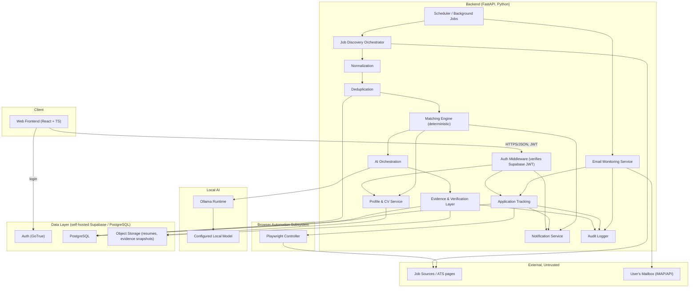
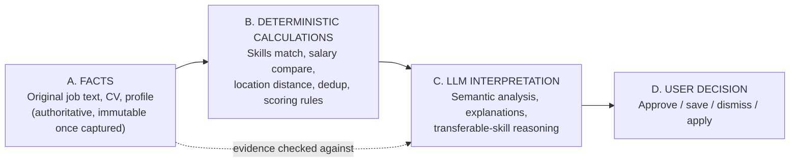
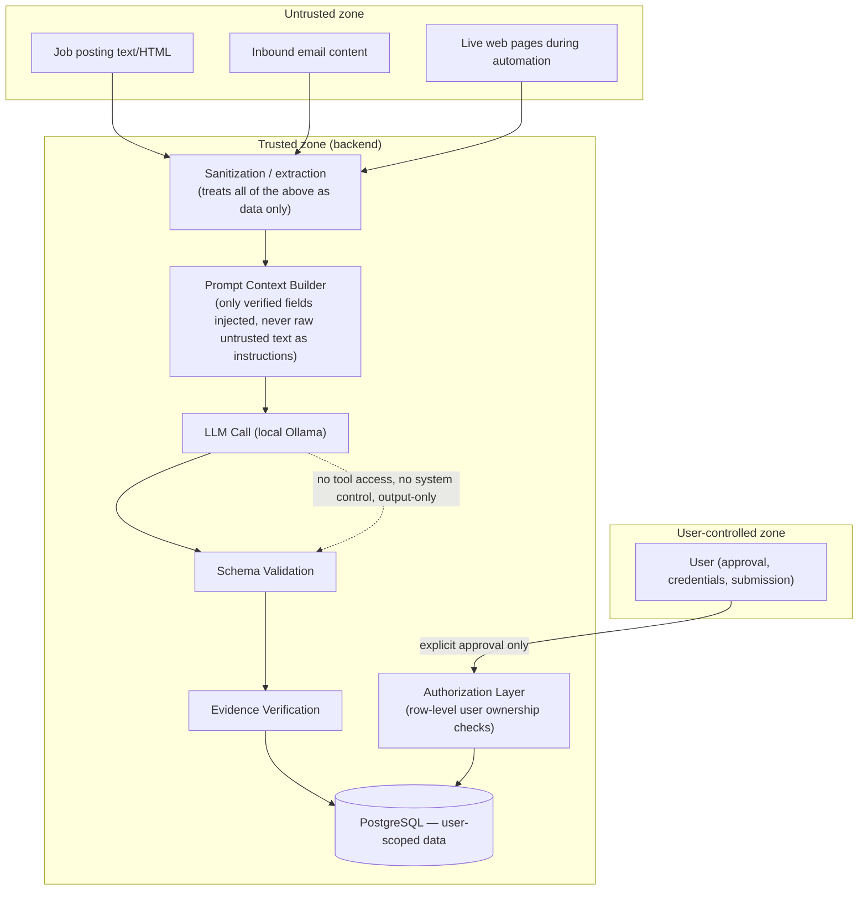

# Architecture Overview

## Component summary

| Component | Responsibility |
|---|---|
| Web Frontend | ADHD-friendly UI. React + TypeScript SPA. No business logic, no direct AI calls. |
| Auth | Login/session issuance. Self-hosted Supabase Auth (GoTrue) — email/password, JWT sessions. |
| API / Backend | All business logic: profile, jobs, matching, AI orchestration, applications, evidence, audit. Python (FastAPI). |
| User Profile & CV Ingestion | Stores structured profile + parsed resume content used by matching and AI. |
| Job Source Connectors | Pluggable adapters (API-based or browser-based) that each produce the same canonical job shape. |
| Job Discovery | Orchestrates connectors on a schedule / on demand. |
| Job Extraction | Pulls full posting content + evidence (text, source URL, optional DOM snapshot) for a discovered job. |
| Normalization | Maps source-specific fields into the canonical job schema. |
| Deduplication | Identifies the same job discovered more than once. |
| Job Database | Canonical, deduplicated job records + evidence + AI analyses + matches. PostgreSQL. |
| Matching Engine | Deterministic scoring against the user profile. |
| AI Analysis Engine | Local Ollama calls for semantic analysis, always against a fixed schema. |
| Evidence & Verification Layer | Checks AI claims against stored evidence; assigns Verified/Inferred/Unknown; rejects unsupported claims. |
| Browser Automation | Playwright-driven subsystem for extraction and application preparation; never submits without approval. |
| Application Tracking | Lifecycle state machine + audit history for each application. |
| Email Monitoring | Reads a connected mailbox, classifies job-related messages, links them to applications. |
| Notifications | Surfaces what needs attention; no separate always-on inbox to manage. |
| Audit Logging | Append-only record of AI calls, matches, state transitions, and automation actions. |
| Scheduler / Background Jobs | Runs discovery, extraction, matching, and email polling on a cadence. |

Every component in this list exists because a requirement in `00-vision-and-requirements.md` needs it. Nothing was added for its own sake — e.g. there is no message queue, no microservice mesh, and no multi-tenant abstraction, because a single-user local system doesn't need them.

## Overall architecture

## Layering and data flow: facts vs. calculation vs. interpretation vs. decision

This separation is the backbone of the whole system (detailed further in `02-ai-and-matching-architecture.md`):

The LLM never sits in path A or B. It only ever consumes facts and deterministic results and produces an interpretation that is itself checked back against A before reaching the user.

## Security boundaries

Key rule: nothing under `Untrusted` zone can directly cause an action; it can only become *data* that trusted, code-controlled steps process. See `08-security-and-prompt-injection.md` for the full threat model.

## Why this shape and not something else

- **One backend service, not microservices.** A single user does not need independent scaling of components; splitting into services would only add operational overhead (more containers, more network hops, more failure modes) with no corresponding benefit. The backend is modular internally (clear module boundaries mirroring the component table) so it could be split later if ever needed, but starts as one deployable.
- **Postgres, not a heavier data platform.** All data here is relational and modestly sized (one user's jobs and applications, not internet-scale). Postgres also gives row-level security, JSONB for flexible AI-analysis payloads, and full-text search — enough for this system without adding a search cluster or NoSQL store.
- **A dedicated Evidence & Verification Layer, not "trust the JSON schema and move on."** Schema validity only proves the AI produced well-formed output, not that the content is true. Verification is what stops confident-sounding hallucinations from reaching the user.
- **Browser automation as an isolated subsystem**, not scattered Playwright calls throughout the codebase, so its safety rules (stop-show-wait) are enforced in one place and are easy to audit.
