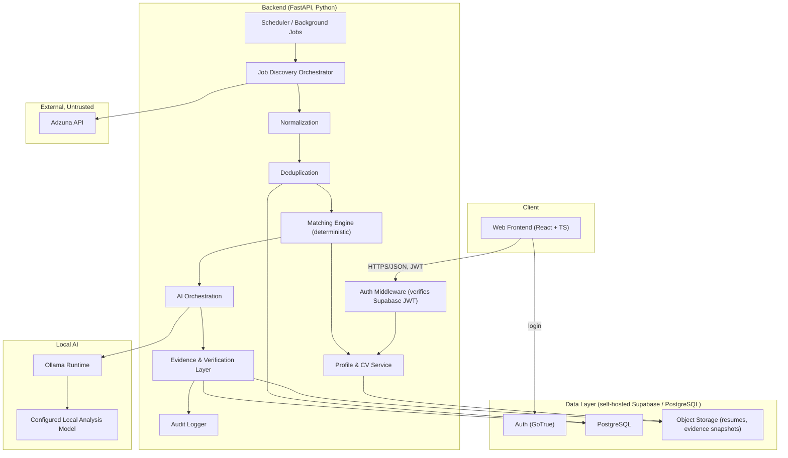
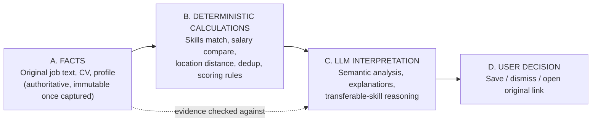

# Architecture Overview

## Component summary

| Component | Responsibility |
|---|---|
| Web Frontend | ADHD-friendly UI. React + TypeScript SPA. No business logic, no direct AI calls. |
| Auth | Login/session issuance. Self-hosted Supabase Auth (GoTrue) — email/password, JWT sessions. |
| API / Backend | All business logic: profile, jobs, matching, AI orchestration, evidence, audit. Python (FastAPI). |
| User Profile & CV Ingestion | Stores structured profile + parsed resume content used by matching and AI. |
| Job Source Connector (Adzuna) | The sole source of job facts. Deterministic Adzuna API queries built from the profile — the AI never searches for, originates, or invents a job. A pluggable adapter interface is retained for future sources, but only Adzuna ships now. |
| Job Discovery | Orchestrates the Adzuna connector on a schedule / on demand. |
| Normalization | Maps Adzuna's fields into the canonical job schema. |
| Deduplication | Identifies the same job discovered more than once (by Adzuna id, then redirect_url, then composite key). |
| Deterministic Pre-Filter | Cheap, pure-code exclusion pass that runs before a job is ever eligible for AI analysis, protecting the shared GPU/RAM budget on the target hardware. |
| Job Database | Canonical, deduplicated job records + evidence + AI analyses + matches. PostgreSQL. |
| Matching Engine | Deterministic scoring against the user profile. |
| AI Analysis Engine | Local Ollama calls (one large, exactly-pinned candidate analysis model, low/queued concurrency) that compare each pre-filtered job against the user's CV/profile, producing a relevance score, recommendation, and evidence-labeled matching skills / matching experience / missing requirements / unknown requirements, then a configurable threshold cutoff — always against a fixed FACT/INFERENCE/UNKNOWN schema. This model is used only for job/CV analysis, never for writing this project's own code (see `14-model-evaluation.md`). |
| Evidence & Verification Layer | Checks AI claims against Adzuna's structured fields (authoritative) and the description snippet; labels each claim FACT/INFERENCE/UNKNOWN; rejects unsupported claims. |
| Audit Logging | Append-only record of AI calls and Adzuna calls. |
| Scheduler / Background Jobs | Runs discovery, normalization, and matching on a cadence. |

Every component in this list exists because a requirement in `00-vision-and-requirements.md` needs it. Nothing was added for its own sake — e.g. there is no message queue, no microservice mesh, no multi-agent orchestration layer, and no multi-tenant abstraction, because a single-user local system doesn't need them.

## Overall architecture

## Layering and data flow: facts vs. calculation vs. interpretation vs. decision

This separation is the backbone of the whole system (detailed further in `02-ai-and-matching-architecture.md`):

The AI never sits in path A or B. It only ever consumes facts and deterministic results and produces an interpretation that is itself checked back against A before reaching the user.

## Untrusted input, handled simply

Job posting text is external, untrusted data. The prompt-context builder inserts it into clearly-delimited data fields of a fixed prompt template rather than concatenating it as instructions, and the model has no tool-calling or function-execution capability of any kind in this product — it can only return the fixed JSON schema (`02-ai-and-matching-architecture.md`). There is no dedicated prompt-injection subsystem, framework, or large adversarial test suite here: because the model cannot execute commands, cannot modify system or project files, cannot apply for jobs, cannot send email, and cannot take any external action, there is no action for injected text to trigger even if it tried. This is a deliberately small, practical precaution, not a security project.

## Authentication, authorization, and secrets — kept simple

- **Authentication**: Supabase Auth (self-hosted GoTrue), email/password, JWT sessions.
- **Authorization**: every request is scoped to the authenticated user via the verified JWT; row-level security in Postgres backs this up as defense-in-depth for the single application user's data.
- **Secrets**: database credentials and Adzuna's `app_id`/`app_key` live in server-side environment configuration only — never in the frontend bundle, never logged.

## Why this shape and not something else

- **One backend service, not microservices.** A single user does not need independent scaling of components; splitting into services would only add operational overhead (more containers, more network hops, more failure modes) with no corresponding benefit. The backend is modular internally (clear module boundaries mirroring the component table) so it could be split later if ever needed, but starts as one deployable.
- **Postgres, not a heavier data platform.** All data here is relational and modestly sized (one user's discovered jobs, not internet-scale). Postgres also gives row-level security, JSONB for flexible AI-analysis payloads, and full-text search — enough for this system without adding a search cluster or NoSQL store.
- **A dedicated Evidence & Verification Layer, not "trust the JSON schema and move on."** Schema validity only proves the AI produced well-formed output, not that the content is true. Verification is what stops confident-sounding hallucinations from reaching the user.
- **No coordinator, no multi-agent orchestration, anywhere in this architecture.** Job discovery, filtering, matching, and analysis are ordinary application modules called in sequence by the backend — not agents coordinating with each other.
