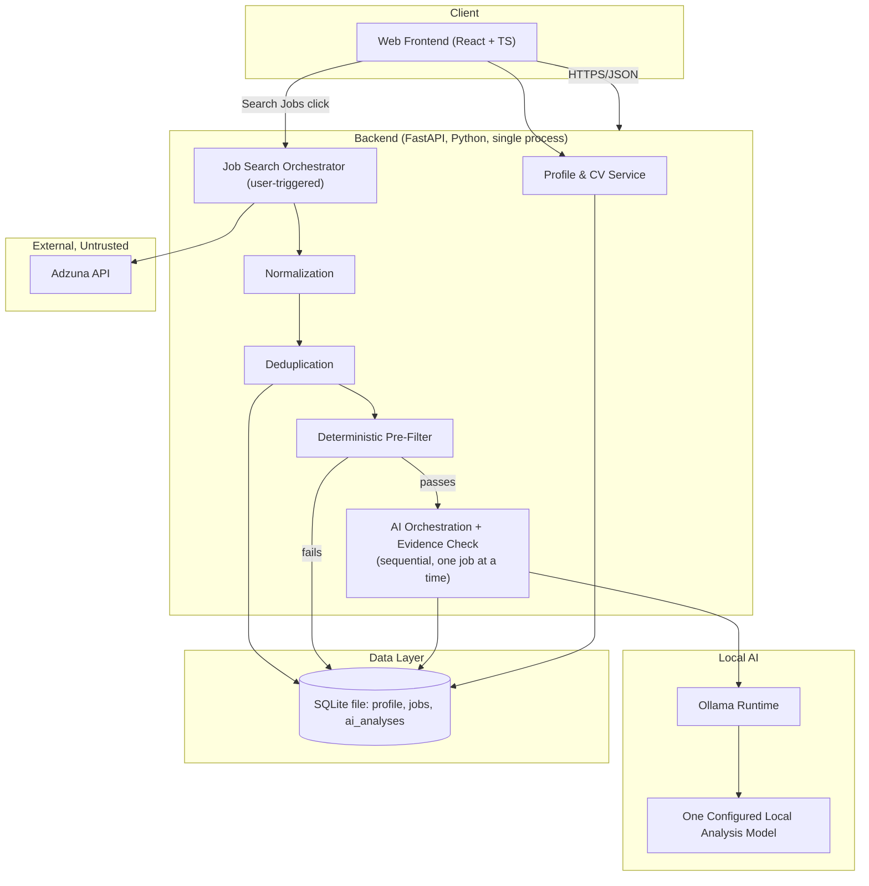
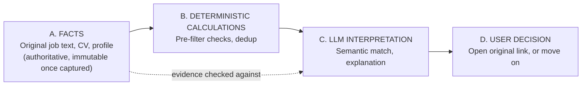

# Architecture Overview

## Component summary

| Component | Responsibility |
|---|---|
| Web Frontend | ADHD-friendly UI. React + TypeScript SPA. No business logic, no direct AI calls. |
| API / Backend | All business logic: profile, job search, matching, AI orchestration, evidence checks. Python (FastAPI). Single process, single deployable. |
| User Profile & CV | Stores the structured profile (CV fields, preferences) used by matching and AI. One row, one user. |
| Job Source Connector (Adzuna) | The sole source of job facts. Deterministic Adzuna API queries built from the profile, run when the user clicks "Search Jobs" — the AI never searches for, originates, or invents a job. A pluggable adapter interface is retained for future sources, but only Adzuna ships now. |
| Normalization | Maps Adzuna's fields into the canonical job schema. |
| Deduplication | Identifies the same job discovered more than once (by Adzuna id, then redirect_url, then composite key). |
| Deterministic Pre-Filter | Cheap, pure-code exclusion pass that runs before a job is ever eligible for AI analysis, protecting the shared GPU/RAM budget on the target hardware. A fixed set of checks, not a configurable weighting framework. |
| SQLite Database | One local file: profile, jobs (with embedded evidence), and AI analysis results. |
| AI Analysis Engine | Calls the single configured local Ollama model, one job at a time, comparing a compact job/CV context and producing a relevance score, recommendation, and evidence-labeled matching skills / matching experience / missing requirements / unknown requirements. This model is used only for job/CV analysis, never for writing this project's own code (see `14-model-evaluation.md`). |
| Evidence Verification | Checks AI claims against the supplied job/CV data; anything unsupported becomes `UNKNOWN`/`NOT_DEMONSTRATED`. A lightweight step inside the AI Analysis Engine, not a separate subsystem. |

Every component in this list exists because a requirement in `00-vision-and-requirements.md` needs it. Nothing was added for its own sake — there is no message queue, no microservice mesh, no multi-agent orchestration layer, no scheduler, no authentication service, and no multi-tenant abstraction, because a single-user local system triggered by hand doesn't need them.

## Overall architecture

## Layering and data flow: facts vs. calculation vs. interpretation vs. decision

This separation is the backbone of the whole system (detailed further in `02-ai-and-matching-architecture.md`):

The AI never sits in path A or B. It only ever consumes facts and deterministic results and produces an interpretation that is itself checked back against A before reaching the user.

## Untrusted input, handled simply

Job posting text is external, untrusted data. The prompt-context builder inserts it into clearly-delimited data fields of a fixed prompt template rather than concatenating it as instructions, and the model has no tool-calling or function-execution capability of any kind in this product — it can only return the fixed JSON schema (`02-ai-and-matching-architecture.md`). There is no dedicated prompt-injection subsystem, framework, or large adversarial test suite here: because the model cannot execute commands, cannot modify system or project files, cannot apply for jobs, cannot send email, and cannot take any external action, there is no action for injected text to trigger even if it tried. This is a deliberately small, practical precaution, not a security project.

## Authentication and secrets — kept minimal

This is a single-user, local application with no `/auth` endpoint and no login screen for the MVP: the person running it on their own machine is the only user, so there is nothing to authenticate against. If the app is ever exposed beyond `localhost` (e.g., accessed over a home network), that is a deliberate future decision requiring its own design, not something this architecture builds speculatively today.

- **Secrets**: the database file path and Adzuna's `app_id`/`app_key` live in server-side environment configuration only — never in the frontend bundle, never logged.
- **Data at rest**: the SQLite file lives on the user's own disk, in a location only that user's OS account can read by default; no server-side encryption layer is added unless a real threat model requires it.

## Why this shape and not something else

- **One backend service, not microservices.** A single user does not need independent scaling of components; splitting into services would only add operational overhead (more containers, more network hops, more failure modes) with no corresponding benefit. The backend is modular internally (clear module boundaries mirroring the component table) so it could be split later if ever needed, but starts as one deployable.
- **SQLite, not a database server.** All data here belongs to one user on one machine: a profile, a list of jobs, and their analysis results. A single file needs no separate database process, no connection pooling, and no network hop — a database *server* like Postgres would add operational surface with no corresponding benefit at this scale (see `06-database-design.md`, ADR-005).
- **A simple, inline evidence check, not a dedicated verification subsystem.** Schema validity only proves the AI produced well-formed output, not that the content is true. A lightweight check — does this claim actually appear in the supplied job/CV data — is what stops confident-sounding hallucinations from reaching the user, without needing a large standalone module.
- **No coordinator, no multi-agent orchestration, anywhere in this architecture.** Job search, filtering, matching, and analysis are ordinary application functions called in sequence by the backend — not agents coordinating with each other.
- **No scheduler, no queue, no auth service for the MVP.** Each of these is real infrastructure with a real operational cost. None is justified by a demonstrated need yet; if one becomes necessary after real usage, it is added deliberately and documented, not built in advance "just in case."
