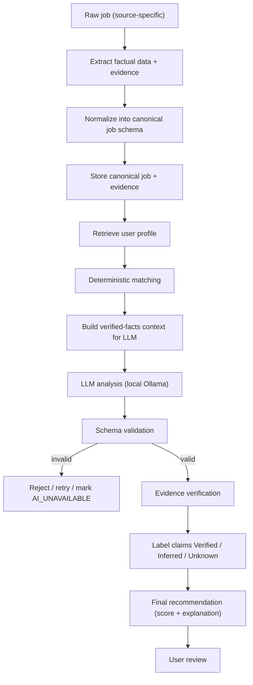
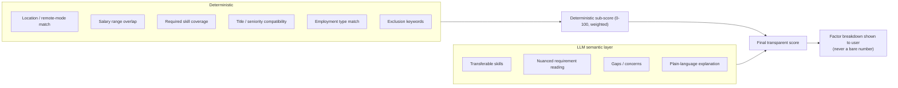
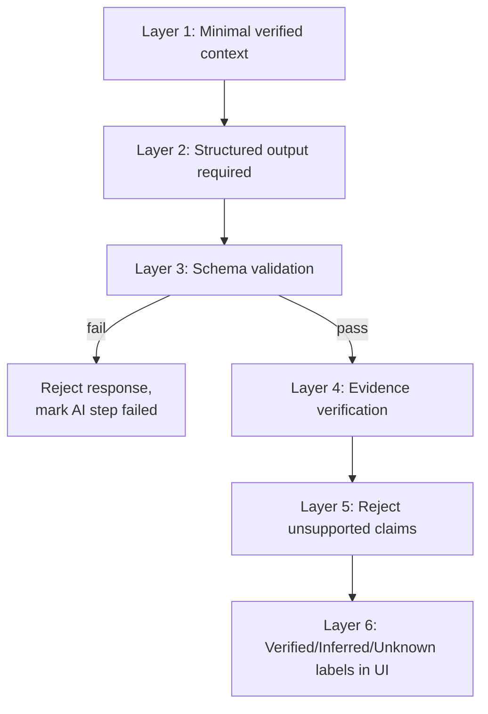

# AI Architecture, Matching, and Hallucination Control

## Conceptual pipeline



This is the same shape used successfully in prototype 1's V1 spec, generalized beyond one ATS and made explicit about the verification step, which prototype 1 had designed for but not yet implemented, and prototype 2 skipped almost entirely (its "AI" edge functions validated JSON shape but never checked claims against the source posting).

## A/B/C/D separation

- **A. Facts** — the immutable source record: original job text (and evidence snapshot), the user's CV/profile as entered. Nothing downstream may alter these.
- **B. Deterministic calculations** — plain code, no LLM: salary range comparison, location/remote compatibility, skill-list intersection, employment-type match, duplicate detection, required-field completeness, and the numeric deterministic sub-scores that feed the final score.
- **C. LLM interpretation** — semantic judgment where language understanding earns its keep: transferable-skill reasoning ("5 years of Django experience is relevant to this Flask role"), summarizing nuanced requirements, flagging concerns, writing the human-readable explanation.
- **D. User decision** — approve, save, dismiss, or apply. The AI's output is always a recommendation, never an action.

**Rule of thumb used throughout:** if a normal `if`/comparison/lookup can compute it reliably, it is computed in B, not asked of the LLM. The LLM is reserved for genuinely fuzzy, language-shaped judgment. This directly fixes a weakness neither prototype fully avoided: prototype 2's edge functions asked the LLM for an overall numeric `score` with no deterministic floor under it.

## Hybrid matching and scoring



- The deterministic sub-score is computed first and is never overridden by the LLM. The LLM may add caveats, surface transferable skills that raise the *displayed* confidence narrative, or flag concerns — but it cannot silently change the underlying deterministic numbers.
- The score shown to the user is always accompanied by its factor breakdown ("Skills: 4/5 required skills present. Location: remote, matches your preference. Salary: posting doesn't state a range — unknown.") No unexplained "AI says 87%."
- Weighting of deterministic factors is user-configurable in the profile (e.g., a user who cares more about remote status than salary can say so); defaults are documented in code, not hidden.

## Structured AI output

Every AI call has a fixed Pydantic (or equivalent JSON Schema) contract. Conceptual schema for the core "analyze job fit" call:

```json
{
  "overall_recommendation": "strong_match | possible_match | weak_match | not_enough_information",
  "confidence": "high | medium | low",
  "matching_skills": ["string, must be traceable to CV or job text"],
  "missing_skills": ["string"],
  "transferable_skills": [{"claim": "string", "basis": "string quoting CV or job text"}],
  "concerns": ["string"],
  "unknowns": ["string — fields the posting does not specify"],
  "explanation": "string, 2-4 sentences, plain language"
}
```

- The model is instructed to cite the specific source fact behind every claim it makes (a `basis` field, or inline reference to the stored evidence excerpt). Claims without a traceable basis are rejected in verification, not passed through.
- Fields the model isn't sure about must go in `unknowns`, not be guessed. The system prompt explicitly rewards "I don't know" over a confident guess (this is a prompting/evaluation stance, not a magic switch — reinforced by verification rejecting unsupported claims regardless of what the model says).

## The six-layer defense against hallucination

1. **Layer 1 — Minimal, verified context.** The LLM only ever receives the normalized job text, the relevant CV/profile fields, and the deterministic match results — never raw arbitrary web content beyond the job posting text itself, and never other users' or system data (there's only one user, but this also means no unrelated internal data leaks into prompts).
2. **Layer 2 — Structured output required.** Every meaningful AI call must return the fixed schema above (or the schema for cover-letter/application-prep calls). Free-text-only responses are not accepted for anything the system will act on or display as fact.
3. **Layer 3 — Schema validation.** Pydantic validation on every response; wrong types, missing required fields, or extra hallucinated fields cause the response to be rejected outright (not coerced/patched).
4. **Layer 4 — Evidence verification.** Every claim in `matching_skills`, `transferable_skills`, `concerns`, and any factual assertion (salary, location, remote status, deadline, requirement) is checked against the stored evidence text (the original job posting and CV). A simple, deterministic substring/semantic-similarity check (not another LLM call) is the first pass; claims that can't be located in the source are downgraded to "Inferred" or dropped to "Unknown" rather than shown as fact.
5. **Layer 5 — Reject unsupported claims.** Anything that fails verification is not silently kept "just in case" — it is either removed from the shown result or explicitly flagged as unverified, never presented at the same confidence level as a verified fact.
6. **Layer 6 — Verified / Inferred / Unknown labeling in the UI.** Every fact-shaped statement the user sees carries one of these three labels, visibly, next to it. This is not cosmetic — it is the user-facing enforcement of the whole pipeline's honesty.



## Never trust the AI's report that something happened

This is the single most important lesson carried over from prototype 1's development history: during development, a coding agent (via OpenCode) fabricated a tool call — it reported success without the underlying action having occurred. That failure mode generalizes far beyond development tooling, and this project treats it as a permanent architectural law for the **product AI** too, not just the dev process:

- If the AI says "I found 3 matching skills," the system independently re-derives/verifies each one against the CV text — it does not just print the AI's list.
- If a browser-automation step reports "form filled" or "application submitted," the system independently re-reads the live page/DOM state to confirm before recording any status change — the AI/automation's own narration is never treated as proof (see `03-job-sources-and-browser-automation.md`).
- If an evidence-recording step says "saved," the database write is confirmed by a read-back, not assumed from a non-erroring function return.
- Audit log entries distinguish "action attempted," "action self-reported as complete by a component," and "action independently verified as complete" — these are three different states and are never collapsed into one.

## LLM / model strategy

- **Runtime**: local Ollama only. No cloud LLM API is called by the production system, ever, and there is no cloud fallback path — if Ollama is unreachable, AI-dependent fields are marked `AI_UNAVAILABLE` and the deterministic match result is still shown (this differs deliberately from prototype 2's "demo fallback," which fabricated plausible-looking fake analysis; see ADR-006).
- **Model adapter layer**: the AI Analysis Engine talks to an internal `LocalModelAdapter` interface (model name, endpoint, prompt templates, and schema per task are all configuration, not hard-coded call sites). Swapping models is a config change, not a code change.
- **Initial model recommendation**: `qwen2.5:14b-instruct` (general instruct variant, not the coder variant) as the default, chosen for strong instruction-following and structured-output reliability at a size that runs on a capable consumer GPU/CPU setup, with `qwen2.5:7b-instruct` documented as the lower-hardware fallback and `llama3.1:8b-instruct` as an alternative if Qwen's licensing or behavior is unsuitable for a given machine. This is a job-understanding and structured-reasoning task, not a coding task, so coder-tuned variants (used for the earlier prototype's ATS-automation development) are not the right choice for the product's analysis model — they were tuned for code generation, not natural-language judgment and instruction adherence.
- **Verification before trust, applied to models too**: before a model is adopted (initially or on upgrade), it is run through the hallucination/evidence test suite (see `09-testing-strategy.md`) with real fixture jobs and a known-correct expected output before being wired into the live pipeline.
- **Selection criteria, in order**: (1) reliable structured JSON output under the schemas above, (2) instruction-following / rule adherence (the model must reliably say "unknown" instead of guessing when asked), (3) hallucination resistance, (4) reasoning quality on job-fit style comparisons, (5) local hardware footprint and speed, (6) general coding ability only where a task genuinely needs it (e.g. none, in this product). Leaderboard coding-benchmark rank is explicitly not a selection criterion, since this AI never writes code for the product.
