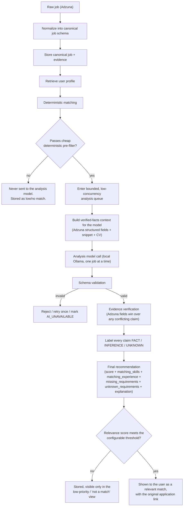
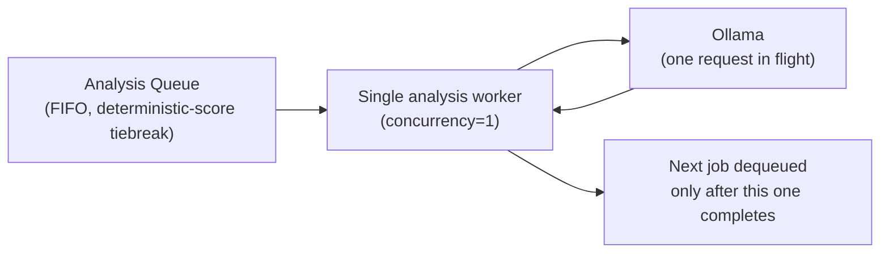
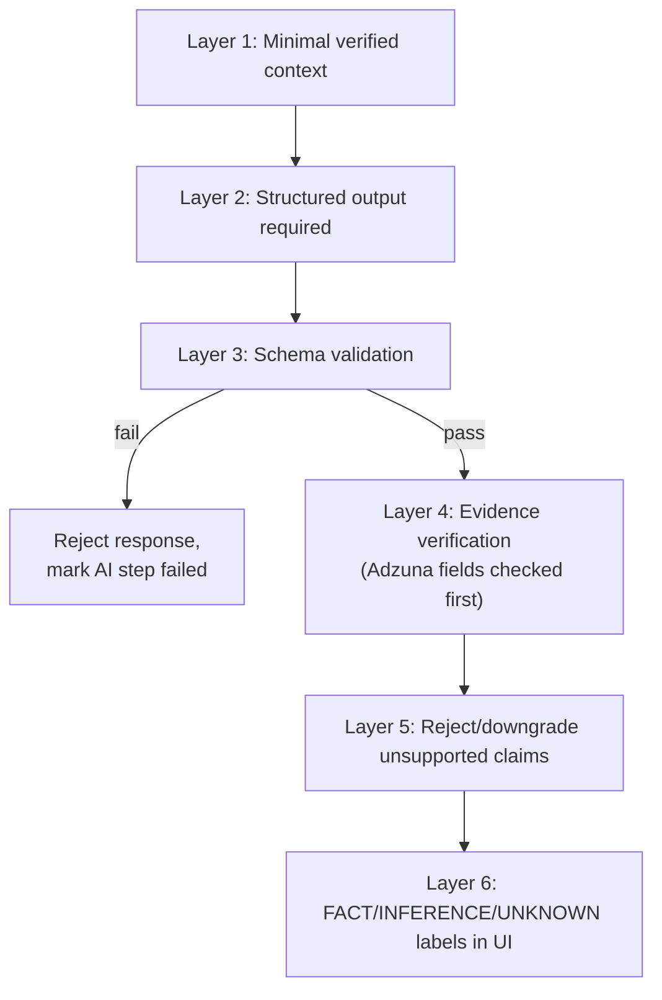

# AI Architecture, Matching, and Hallucination Control

## Conceptual pipeline



## A/B/C/D separation

- **A. Facts** — the immutable source record: Adzuna's structured fields and description snippet, the user's CV/profile as entered. Adzuna's structured fields are the highest tier of fact in this system (see `03-job-sources.md`, "Adzuna wins"). Nothing downstream may alter these.
- **B. Deterministic calculations** — plain code, no AI: salary range comparison, location/remote compatibility, skill-list intersection, employment-type match, duplicate detection, required-field completeness, the deterministic pre-filter (below), and the numeric deterministic sub-scores that feed the final score.
- **C. AI interpretation** — semantic judgment where language understanding earns its keep: comparing the job against the user's CV/profile, transferable-skill reasoning, summarizing nuanced requirements from the description snippet, flagging concerns, writing the human-readable explanation. The model itself never searches, never queries Adzuna, and never decides what jobs exist; it only ever compares jobs Adzuna already returned against the CV/profile it's given.
- **D. User decision** — save, dismiss, or open the original application link. The AI's output is always a recommendation, never an action.

**Rule of thumb:** if a normal `if`/comparison/lookup can compute it reliably from Adzuna's structured fields, it is computed in B, not asked of the model.

## Cheap deterministic pre-filter — before anything reaches the analysis model

Every job that passes normalization and dedup goes through a fast, pure-code pre-filter *before* it is eligible for AI analysis at all, considering: job title, required keywords, technical skills, location, salary, employment type, remote/hybrid/on-site preference, experience level, and configured exclusions.

- Hard exclusion keywords present (title/description) → excluded, never queued.
- Required-skill floor not met (e.g. zero overlap with the profile's required skills) → excluded, never queued.
- Location/remote-mode incompatible with the profile's acceptance settings → excluded, never queued.
- Salary (where Adzuna states it, accounting for `salary_is_predicted`) below the profile's stated minimum → excluded, never queued.

Jobs that fail this pre-filter are still stored (visible to the user in a low-priority/"not a match" view if they want to look) but are **never sent to Ollama**. This exists for two reasons at once: it keeps the transparent-score promise honest (a job with zero required skills shouldn't need a large model to tell the user it's not a fit), and — just as importantly given the target hardware (see `14-model-evaluation.md`) — it keeps GPU/RAM load down and avoids unnecessary, expensive LLM calls by only ever running the model on jobs worth the cost.

## Relevance-threshold cutoff — after scoring, before the user ever sees it

Passing the pre-filter and getting an AI analysis does not by itself make a job "relevant" to the user. After the six-layer defense (below) produces a verified `score`, that score is compared against a configurable threshold (a profile-level setting, sensible default provided): jobs at or above the threshold are surfaced in the normal review queues; jobs below it are stored and reachable in a low-priority view, but do not compete for the user's attention on the Home/Today screen or Job Review queue.

## LLM concurrency: low and queued, never parallel-blasted

The AI Analysis Engine processes jobs through a **bounded, low-concurrency queue** — the default and required configuration is **concurrency = 1** (exactly one job in flight against Ollama at a time); a configuration ceiling exists but is not expected to be raised above a small number even on capable hardware, and must never be set high enough to fire many simultaneous requests at Ollama, and the app never automatically loads multiple large models at once. This is a hard architectural rule, not a performance nice-to-have: the target machine (`14-model-evaluation.md`) runs Ollama alongside other active software sharing the same 32GB system RAM and 16GB GPU, and uncontrolled concurrent inference is the single fastest way to exhaust either budget or starve the rest of the machine. The queue is FIFO by default, with the deterministic score used as a tiebreaker so the strongest candidate jobs are analyzed first if the queue backs up.



## Hybrid matching and scoring


The deterministic sub-score is computed first and is never overridden by the AI. The score shown to the user is always accompanied by its factor breakdown. Weighting of deterministic factors is user-configurable in the profile.

## Structured AI output — the exact schema

Every AI call has a fixed Pydantic contract:

```json
{
  "score": "integer 0-100, the relevance score the threshold cutoff is applied to",
  "recommendation": "strong_match | possible_match | weak_match | not_enough_information",
  "confidence": "high | medium | low",
  "matching_skills": [
    {
      "claim": "string naming the matched skill and how it applies",
      "verification_status": "FACT | INFERENCE | UNKNOWN",
      "source_excerpt": "string quoting the exact CV/profile and/or job text supporting this match, or null if UNKNOWN"
    }
  ],
  "matching_experience": [
    {
      "claim": "string naming the matched experience (work history, networking, cybersecurity, sysadmin, education, certifications, etc.) and how it applies",
      "verification_status": "FACT | INFERENCE | UNKNOWN",
      "source_excerpt": "string, or null if UNKNOWN"
    }
  ],
  "missing_requirements": [
    {
      "claim": "string naming a stated job requirement the CV/profile does not demonstrate",
      "source_excerpt": "string quoting the job text stating the requirement"
    }
  ],
  "unknown_requirements": [
    {
      "claim": "string naming a stated job requirement for which the CV/profile has no information either way",
      "source_excerpt": "string quoting the job text stating the requirement"
    }
  ],
  "explanation": "string, 2-4 sentences, plain language",
  "evidence": [
    {
      "claim": "string, any other factual statement (salary, location, remote_status, etc.)",
      "verification_status": "FACT | INFERENCE | UNKNOWN",
      "source_excerpt": "string quoting the exact Adzuna field or description snippet text supporting this claim, or null if UNKNOWN"
    }
  ]
}
```

`matching_skills`, `matching_experience`, `missing_requirements`, and `unknown_requirements` are the named categories the UI surfaces directly for every retained job, alongside `score`, `recommendation`, `confidence`, and `explanation`. `evidence` carries any remaining factual claims (e.g. Adzuna-field-derived statements) using the same evidence-item shape, so the FACT/INFERENCE/UNKNOWN discipline applies uniformly across the whole response.

**`missing_requirements` vs. `unknown_requirements`:** these are deliberately distinct. `missing_requirements` is for a requirement the job clearly states and the CV/profile clearly does **not** demonstrate (e.g. job requires Kubernetes, CV never mentions it → `missing_requirements`, not a match). `unknown_requirements` is for a requirement the job states but the CV/profile simply doesn't say anything about either way — not a demonstrated gap, just genuinely unknown. Neither is ever silently upgraded into `matching_skills`/`matching_experience`.

Every individual claim carries its own `verification_status`:

- **`FACT`** — directly stated in an Adzuna structured field or the CV/profile, or located verbatim/near-verbatim in the description snippet, and confirmed by the deterministic verifier (below) against that exact source, not just asserted by the model. `source_excerpt` is mandatory and must be a real substring of the evidence, not a paraphrase. Example: job requires Cisco networking, CV lists "Cisco Catalyst switch administration" → `matching_skills` entry, `FACT`, quoting both.
- **`INFERENCE`** — a reasonable semantic judgment the model is allowed to make (transferable skills, "this role likely involves X given the description's phrasing") that is not directly stated. Always shown to the user distinctly from `FACT`, always carries a `source_excerpt` showing what it was inferred *from*, and is never used to satisfy a deterministic hard filter.
- **`UNKNOWN`** — the model correctly identifies that the CV/profile does not demonstrate something the job requires, or that Adzuna's structured fields/snippet don't specify something. `source_excerpt` is `null` where nothing exists to quote. This is a rewarded, correct answer, not a failure. Example: job requires Kubernetes experience, CV doesn't mention it → the model must say `UNKNOWN`/not demonstrated, never "candidate has Kubernetes experience."

The model must never fabricate a skill, certification, work-history entry, education credential, language, salary figure, location, or job requirement that isn't actually present in its source data. If information doesn't exist in the CV/profile or in Adzuna's data, the correct output is `UNKNOWN`, never an invented positive.

Any claim covering a field Adzuna states structurally (`salary`, `location`, `remote_status` where derivable) is checked directly against that Adzuna field, not the free-text snippet — and if the claim conflicts with Adzuna's value, the claim is rejected outright regardless of its self-reported `verification_status` (per "Adzuna wins," `03-job-sources.md`).

## The six-layer defense against hallucination

1. **Layer 1 — Minimal, verified context.** The model receives only the normalized job (Adzuna fields + snippet), the relevant CV/profile fields — work experience, technical skills, networking experience, cybersecurity experience, sysadmin experience, education, certifications, languages, desired roles, location/salary/remote preferences, experience level (`00-vision-and-requirements.md` requirement 5) — and the deterministic match results — nothing else, and never other users' or system data. Any field absent from the CV/profile is simply not present in the context; the model is never handed a placeholder or assumed value for it.
2. **Layer 2 — Structured output required.** Every meaningful AI call returns the fixed schema above. Free-text-only responses are never accepted for anything the system will act on or display as fact.
3. **Layer 3 — Schema validation.** Pydantic validation on every response; wrong types, missing required fields, or extra hallucinated fields cause outright rejection, not coercion.
4. **Layer 4 — Evidence verification.** Every claim is checked: Adzuna-structural claims against the Adzuna field directly; CV/profile-derived claims against the stored profile data; snippet-derived claims against the stored description text via deterministic substring/similarity matching (not another LLM call).
5. **Layer 5 — Reject unsupported claims.** Anything that fails verification is removed or its `verification_status` is force-corrected to `UNKNOWN`/rejected — never silently kept at its self-reported status.
6. **Layer 6 — FACT / INFERENCE / UNKNOWN labeling in the UI.** Every claim the user sees carries its label visibly. This is the user-facing enforcement of the whole pipeline's honesty.



This layered approach is deliberately kept simple and practical — it is normal input validation and evidence-checking, not a dedicated security framework. Job text is treated as data throughout; the model is never given any tool that could execute a command, modify a file, or take an external action, so there is no action for a manipulated response to trigger even in the worst case (see `01-architecture-overview.md`, "Untrusted input, handled simply").

## Never trust the AI's report that something happened

Carried forward as a permanent architectural law (see ADR-002): if the model says a claim is a `FACT`, the system re-derives/verifies it against Adzuna's fields, the CV/profile, or the snippet before treating it as one. This governs *machine* self-reports; it does not apply to the user's own direct actions (e.g. saving or dismissing a job), which are authoritative by definition.

## Analysis model vs. coding model — two separate roles, never mixed

The **analysis model** is the large local Ollama model the *finished application* uses at runtime to compare jobs against a CV/profile and produce the structured output above. The **coding model** is whatever model a coding agent uses during development to help write or modify this project's own source code. These are completely separate roles with separate selection criteria and are never assumed to be the same model or interchangeable:

- **Runtime**: local Ollama only, for the analysis model. No cloud LLM API, no cloud fallback, no Claude integration of any kind in the product. If Ollama is unreachable or the configured analysis model is missing, AI-dependent fields are marked `AI_UNAVAILABLE` and the deterministic match result is still shown (ADR-006) — no fabricated "demo" analysis is ever generated.
- **Exactly one analysis model at a time, pinned by exact tag.** The current leading candidate, chosen against the real target hardware and pending real-hardware benchmark validation, is `qwen2.5:14b-instruct-q4_K_M` — see `14-model-evaluation.md` for the selection criteria, the full hardware budget it was chosen against, its candidate status, and the manual-pull/no-auto-download/no-silent-substitution contract. Selection is based on reasoning quality, instruction following, CV/job matching accuracy, structured output reliability, hallucination rate, and the ability to correctly say `UNKNOWN` — never on coding-benchmark performance.
- **Model adapter layer**: the AI Analysis Engine talks to an internal `LocalModelAdapter` interface (model name/tag, endpoint, prompt templates, and schema per task are configuration, not hard-coded call sites) so a future analysis-model change is a config change, not a code change — but changing the pinned model is still a deliberate, documented decision (see `14-model-evaluation.md`), never an automatic upgrade.
