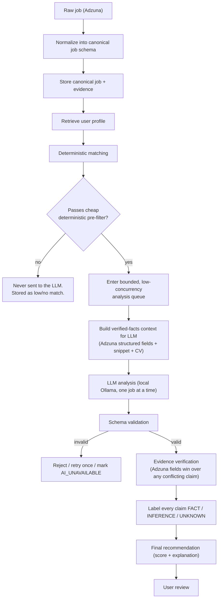
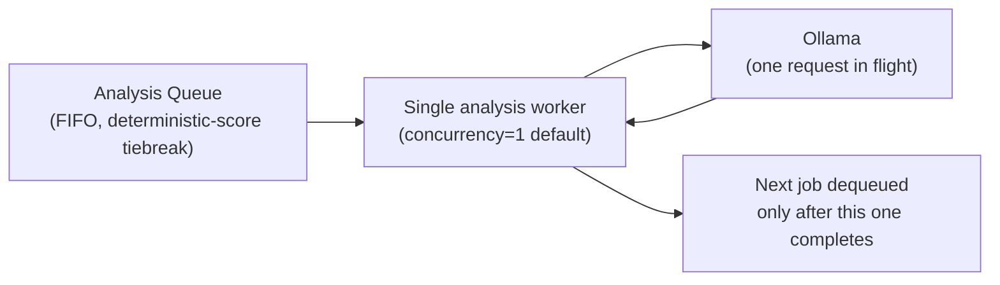
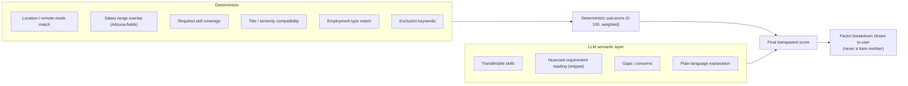
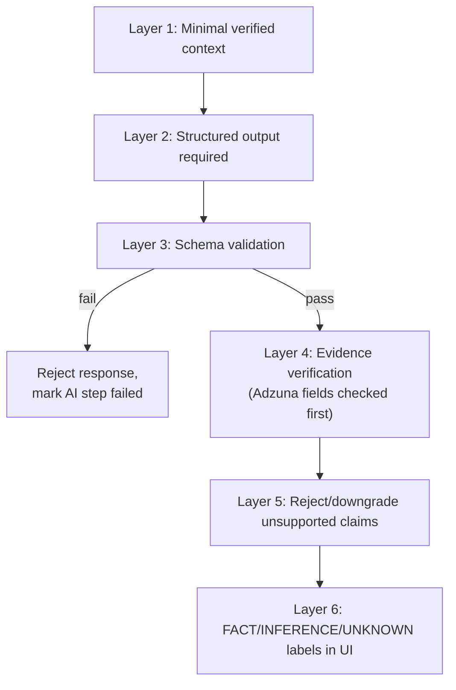

# AI Architecture, Matching, and Hallucination Control

## Conceptual pipeline



## A/B/C/D separation

- **A. Facts** — the immutable source record: Adzuna's structured fields and description snippet, the user's CV/profile as entered. Adzuna's structured fields are the highest tier of fact in this system (see `03-job-sources-and-browser-automation.md`, "Adzuna wins"). Nothing downstream may alter these.
- **B. Deterministic calculations** — plain code, no LLM: salary range comparison, location/remote compatibility, skill-list intersection, employment-type match, duplicate detection, required-field completeness, the deterministic pre-filter (below), and the numeric deterministic sub-scores that feed the final score.
- **C. LLM interpretation** — semantic judgment where language understanding earns its keep: transferable-skill reasoning, summarizing nuanced requirements from the description snippet, flagging concerns, writing the human-readable explanation. The LLM never searches, never queries Adzuna, never decides what jobs exist.
- **D. User decision** — approve, save, dismiss, or apply. The AI's output is always a recommendation, never an action.

**Rule of thumb:** if a normal `if`/comparison/lookup can compute it reliably from Adzuna's structured fields, it is computed in B, not asked of the LLM.

## Cheap deterministic pre-filter — before anything reaches the LLM

Every job that passes normalization and dedup goes through a fast, pure-code pre-filter *before* it is eligible for LLM analysis at all:

- Hard exclusion keywords present (title/description) → excluded, never queued.
- Required-skill floor not met (e.g. zero overlap with the profile's required skills) → excluded, never queued.
- Location/remote-mode incompatible with the profile's acceptance settings → excluded, never queued.
- Salary (where Adzuna states it, accounting for `salary_is_predicted`) below the profile's stated minimum → excluded, never queued.

Jobs that fail this pre-filter are still stored (visible to the user in a low-priority/"not a match" view if they want to look) but are **never sent to Ollama**. This exists for two reasons at once: it keeps the transparent-score promise honest (a job with zero required skills shouldn't need an LLM to tell the user it's not a fit), and — just as importantly given the target hardware (see `14-model-evaluation.md`) — it keeps GPU/RAM load down by only ever running the LLM on jobs worth the cost.

## LLM concurrency: low and queued, never parallel-blasted

The AI Analysis Engine processes jobs through a **bounded, low-concurrency queue** — the default and recommended configuration is **concurrency = 1** (exactly one job in flight against Ollama at a time); a configuration ceiling exists but is not expected to be raised above a small number (2–3) even on capable hardware, and must never be set high enough to fire many simultaneous requests at Ollama. This is a hard architectural rule, not a performance nice-to-have: the target machine (`14-model-evaluation.md`) runs Ollama alongside other active software sharing the same 32GB system RAM and 16GB GPU, and uncontrolled concurrent inference is the single fastest way to exhaust either budget or starve the rest of the machine. The queue is FIFO by default, with the deterministic score used as a tiebreaker so the strongest candidate jobs are analyzed first if the queue backs up.



## Hybrid matching and scoring



The deterministic sub-score is computed first and is never overridden by the LLM. The score shown to the user is always accompanied by its factor breakdown. Weighting of deterministic factors is user-configurable in the profile.

## Structured AI output and the evidence-claim schema

Every AI call has a fixed Pydantic contract. Conceptual schema for the core "analyze job fit" call:

```json
{
  "overall_recommendation": "strong_match | possible_match | weak_match | not_enough_information",
  "confidence": "high | medium | low",
  "claims": [
    {
      "claim": "string, a single factual or semantic statement",
      "claim_type": "salary | location | remote_status | requirement | qualification | benefit | deadline | skill | transferable_skill | other",
      "verification_status": "FACT | INFERENCE | UNKNOWN",
      "source_excerpt": "string quoting the exact Adzuna field or description snippet text supporting this claim, or null if UNKNOWN",
      "confidence": "high | medium | low"
    }
  ],
  "concerns": ["string"],
  "explanation": "string, 2-4 sentences, plain language"
}
```

Every individual claim the model makes — not just the response as a whole — carries its own `verification_status`:

- **`FACT`** — directly stated in an Adzuna structured field or located verbatim/near-verbatim in the description snippet, and confirmed by the deterministic verifier (below) against that exact source, not just asserted by the model. `source_excerpt` is mandatory and must be a real substring of the evidence, not a paraphrase.
- **`INFERENCE`** — a reasonable semantic judgment the LLM is allowed to make (transferable skills, "this role likely involves X given the description's phrasing") that is not directly stated. Always shown to the user distinctly from `FACT`, always carries a `source_excerpt` showing what it was inferred *from*, and is never used to satisfy a deterministic hard filter — inferences inform the narrative, never the pass/fail gates in section "Cheap deterministic pre-filter" above.
- **`UNKNOWN`** — the model correctly identifies that neither Adzuna's structured fields nor the description snippet specify something (e.g. remote policy, benefits, exact seniority). `source_excerpt` is `null`. This is a rewarded, correct answer, not a failure — a model that says `UNKNOWN` where information genuinely isn't present is doing its job.

Any claim with `claim_type` covering a field Adzuna states structurally (`salary`, `location`, `remote_status` where derivable, `deadline` if Adzuna provides one) is checked directly against that Adzuna field, not the free-text snippet — and if the claim conflicts with Adzuna's value, the claim is rejected outright regardless of its self-reported `verification_status` (per "Adzuna wins," `03-job-sources-and-browser-automation.md`).

## The six-layer defense against hallucination

1. **Layer 1 — Minimal, verified context.** The LLM receives only the normalized job (Adzuna fields + snippet), the relevant CV/profile fields, and the deterministic match results — nothing else, and never other users' or system data.
2. **Layer 2 — Structured output required.** Every meaningful AI call returns the fixed schema above. Free-text-only responses are never accepted for anything the system will act on or display as fact.
3. **Layer 3 — Schema validation.** Pydantic validation on every response; wrong types, missing required fields, or extra hallucinated fields cause outright rejection, not coercion.
4. **Layer 4 — Evidence verification.** Every claim is checked: Adzuna-structural claims against the Adzuna field directly; snippet-derived claims against the stored description text via deterministic substring/similarity matching (not another LLM call).
5. **Layer 5 — Reject unsupported claims.** Anything that fails verification is removed or its `verification_status` is force-corrected to `UNKNOWN`/rejected — never silently kept at its self-reported status.
6. **Layer 6 — FACT / INFERENCE / UNKNOWN labeling in the UI.** Every claim the user sees carries its label visibly. This is the user-facing enforcement of the whole pipeline's honesty.



## Never trust the AI's report that something happened

Carried forward unchanged as a permanent architectural law (see ADR-002): if the AI says a claim is a `FACT`, the system re-derives/verifies it against Adzuna's fields or the snippet before treating it as one. If automation reports "form filled" or "application submitted," the system independently re-reads the live page/DOM state before recording any status change. Audit log entries distinguish "action attempted," "self-reported as complete," and "independently verified as complete" as three separate states, never collapsed into one.

## LLM / model strategy

- **Runtime**: local Ollama only. No cloud LLM API, no cloud fallback. If Ollama is unreachable or the configured model is missing, AI-dependent fields are marked `AI_UNAVAILABLE` and the deterministic match result is still shown (ADR-006) — no fabricated "demo" analysis is ever generated.
- **Exactly one model, pinned by exact tag, chosen for the real target hardware.** See `14-model-evaluation.md` for the selection, the full hardware budget it was chosen against, and the manual-pull/no-auto-download/no-silent-substitution contract.
- **Model adapter layer**: the AI Analysis Engine talks to an internal `LocalModelAdapter` interface (model name/tag, endpoint, prompt templates, and schema per task are configuration, not hard-coded call sites) so a future model change is a config change, not a code change — but changing the pinned model is still a deliberate, documented decision (see `14-model-evaluation.md`), never an automatic upgrade.
