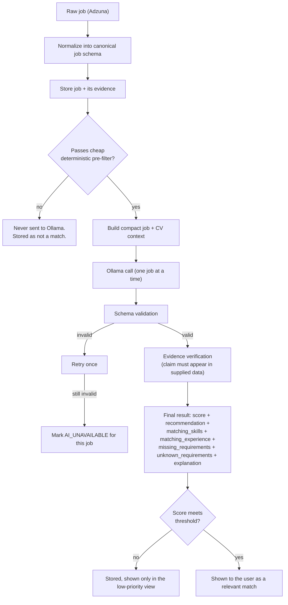

# AI Architecture and Matching (Simplified)

This document replaces an earlier, more elaborate version of this architecture (a six-layer hallucination-defense system and a configurable matching-weight framework). Both were simplified away deliberately: they added process and surface area without adding matching quality. What follows is the whole pipeline.

## The pipeline

```
Job data + relevant CV/profile data
        |
        v
Local Ollama model
        |
        v
Structured JSON response
        |
        v
Schema validation
        |
        v
Simple evidence verification
        |
        v
Final score + explanation
```



## Two-stage matching

**Stage 1 — code, before Ollama is ever called.** A cheap, pure-code pre-filter checks: location, salary, employment type, experience level, obvious excluded keywords, obvious required skills, and the user's configured job preferences. This is a fixed set of deterministic checks, not a configurable weighting framework — it exists to remove clearly irrelevant jobs cheaply, protecting the GPU/RAM budget on the target hardware (`14-model-evaluation.md`). Jobs that fail are stored but never queued for AI analysis.

**Stage 2 — Ollama, only for jobs that survive Stage 1.** The model evaluates semantic compatibility between the job's requirements and responsibilities and the candidate's CV/profile and preferences. It returns:

- `score` (0-100)
- `recommendation`
- `matching_skills`
- `matching_experience`
- `missing_requirements`
- `unknown_requirements`
- a concise `explanation`
- `evidence`

The deterministic stage decides *whether* a job is worth analyzing; the model decides *how well* it matches. Nothing about the deterministic checks is user-configurable per-factor weighting for the MVP — that kind of tunable scoring framework is explicitly not being built until there's a real reason to.

## Structured AI output — the schema

Every AI call has a fixed Pydantic contract:

```json
{
  "score": "integer 0-100",
  "recommendation": "strong_match | possible_match | weak_match | not_enough_information",
  "confidence": "high | medium | low",
  "matching_skills": [
    {"claim": "string", "source_excerpt": "string quoting the supplied CV/job text, or null"}
  ],
  "matching_experience": [
    {"claim": "string", "source_excerpt": "string quoting the supplied CV/job text, or null"}
  ],
  "missing_requirements": [
    {"claim": "string naming a stated job requirement the CV does not demonstrate", "source_excerpt": "string quoting the job text"}
  ],
  "unknown_requirements": [
    {"claim": "string naming a stated job requirement the CV says nothing about either way", "source_excerpt": "string quoting the job text"}
  ],
  "explanation": "string, 2-4 sentences, plain language",
  "evidence": [
    {"claim": "string, any other factual statement (salary, location, remote_status, etc.)", "source_excerpt": "string, or null"}
  ]
}
```

`missing_requirements` vs. `unknown_requirements`: `missing_requirements` is for a requirement the job clearly states and the CV clearly does **not** demonstrate. `unknown_requirements` is for a requirement the job states but the CV says nothing about either way — genuinely unknown, not a demonstrated gap. Neither is ever silently upgraded into `matching_skills`/`matching_experience`.

The model must never invent a candidate skill, certification, work-history entry, education credential, language, salary figure, location, or job requirement that isn't actually present in the data it was given. If information doesn't exist in the supplied CV/profile or job data, the correct output is `UNKNOWN`/`NOT_DEMONSTRATED`, never an invented positive.

## The five protections (and nothing more)

1. **Strict structured output.** The model is only ever asked for the fixed JSON schema above — no free-text-only response is accepted for anything the system will act on or display as fact.
2. **Schema validation.** Pydantic validation on every response; wrong types, missing required fields, or extra fields cause rejection.
3. **Evidence must reference the supplied data.** Each `source_excerpt` is checked against the job/CV context that was actually sent to the model for that call — a simple substring/containment check, not a separate verification service. A claim whose excerpt doesn't appear in the supplied data is not shown as supported.
4. **Unsupported claims become `UNKNOWN` or `NOT_DEMONSTRATED`.** Anything that fails the evidence check is downgraded, never kept at face value.
5. **Invalid model output is rejected and retried once if appropriate.** A malformed response gets one retry; if the retry also fails, that job's AI analysis is marked `AI_UNAVAILABLE` and the deterministic pre-filter result is still shown — no fabricated "demo" analysis is ever generated (ADR-006).

That is the complete list. There is no six-layer defense architecture, no dedicated verification module, and no separate claim-by-claim FACT/INFERENCE/UNKNOWN taxonomy beyond what's needed to say "supported" vs. "not supported, so `UNKNOWN`." Job text is treated as data throughout; the model has no tool access and can't take any action, so there's nothing for a manipulated response to trigger even in the worst case (`01-architecture-overview.md`, "Untrusted input, handled simply").

## Compact context — what actually gets sent to Ollama

Only relevant information is sent, per call, to keep context size, RAM/VRAM usage, and inference time down:

- **Candidate profile (compact form)**: target roles, experience (condensed), technical skills, certifications, education, languages, location, salary requirements, work-mode preference. Not sent: database metadata, internal IDs, UI-only fields, or unrelated jobs.
- **Job data (compact form)**: the current job's normalized title, company, location, salary, employment type, requirements, and description snippet. Not sent: other candidate jobs, Adzuna's raw response envelope, or historical analysis data from previous runs.

One job is analyzed per call. The model never sees more than one job's data and the profile at a time — this keeps each call's context small and predictable regardless of how many jobs a search returns.

## Sequential processing, not a queue

Jobs that pass the pre-filter are analyzed **one at a time, in a simple loop**:

```
for each filtered job:
    prepare relevant job data
    prepare relevant candidate data
    send to Ollama
    validate response
    verify evidence
    save result
    continue
```

There is no queue, no worker pool, and no background job system for the MVP. This is a plain sequential function running as part of handling the user's "Search Jobs" request (or a small background task with the same one-at-a-time behavior, if search results shouldn't block the HTTP request — an implementation detail, not an architectural layer). A queue/background-worker architecture is not built now; it is only introduced later if real performance testing on the target hardware shows the sequential loop is genuinely insufficient.

Concurrency is fixed at 1: exactly one Ollama request in flight at a time, ever. This is a hard constraint, not a tunable default — see ADR-010 and `14-model-evaluation.md` for why (the target machine's 16GB VRAM and 32GB RAM are shared with other running software).

## Adzuna wins: structured source data is authoritative over any AI claim

Wherever Adzuna provides a structured field — `salary_min`/`salary_max`, `location`, `contract_type`, `company`, `created`, `redirect_url` — that field is authoritative. If the model's output states or implies something different, the deterministic value wins and the model's conflicting claim is discarded before it reaches the user.

## Analysis model vs. coding model — two separate roles, never mixed

The **analysis model** is the single local Ollama model the *finished application* uses at runtime to compare jobs against a CV/profile. The **coding model** is whatever model a coding agent uses during development to help write or modify this project's own source code. These are completely separate roles, never assumed to be the same model or interchangeable:

- **Runtime**: local Ollama only, for the analysis model. No cloud LLM API, no cloud fallback, no Claude integration of any kind in the product. If Ollama is unreachable or the configured analysis model is missing, AI-dependent fields are marked `AI_UNAVAILABLE` and the deterministic pre-filter result is still shown (ADR-006) — no fabricated "demo" analysis is ever generated.
- **Exactly one analysis model, pinned by exact tag.** No multi-model orchestration, no model routing, no automatic fallback to a different model, no automatic downloads, no automatic updates, and never more than one large model loaded at once. The current leading candidate, pending real-hardware benchmark validation, is `qwen2.5:14b-instruct-q4_K_M` — see `14-model-evaluation.md`.
- **Model check, not model management.** Before any AI call, the backend checks whether the exact configured tag is installed in the local Ollama instance. If not, it returns a clear error naming the exact model and the exact `ollama pull` command. It never pulls, downloads, or substitutes a model on its own.
