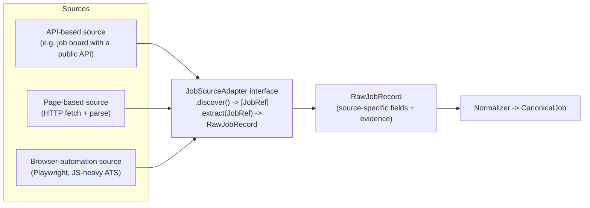
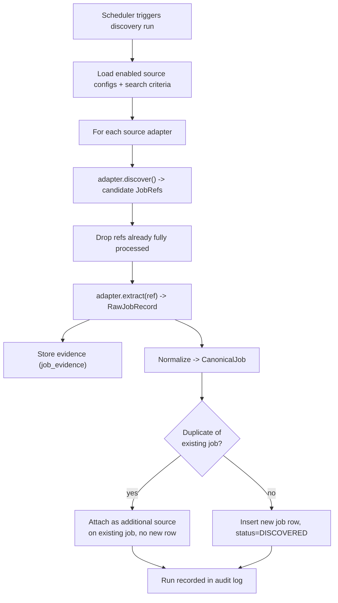
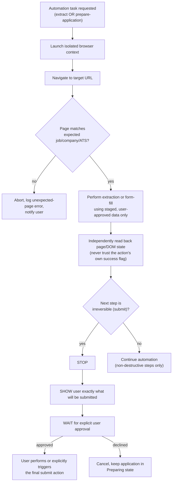

# Job Sources and Browser Automation

## Source abstraction

Every job source — a public API, a scraped web page, or an ATS reached via browser automation — implements the same adapter interface and produces the same output shape, so the rest of the system never knows or cares which kind of source a job came from.

- `discover()` returns lightweight references (URL/ID) to candidate jobs for a search configuration.
- `extract()` returns a `RawJobRecord`: whatever fields that source naturally provides, plus mandatory evidence fields — `source_name`, `source_url`, `raw_text` (the extracted posting text), `raw_html_snapshot` (optional, stored for higher-value sources where layout drift is a risk), and `extracted_at`.
- New sources are added by implementing this interface and registering the adapter — the discovery orchestrator, normalizer, dedup, matching, and AI layers are never touched.

## Source data vs. normalized data vs. AI analysis — kept separate at all times

| Layer | What it contains | Mutable? |
|---|---|---|
| `RawJobRecord` (source data) | Exactly what the source gave us, plus evidence | Immutable once stored |
| `CanonicalJob` (normalized data) | Source data mapped into the shared schema; missing fields stay null, never invented | Only re-derived by re-running normalization on new raw data, never hand-edited |
| `AIAnalysis` (AI output) | The LLM's structured, validated, verified interpretation of a `CanonicalJob` | Replaced wholesale on re-analysis; never merged/patched in place |

Keeping these as distinct, separately-stored records (see `06-database-design.md`: `job_evidence`, `jobs`, `ai_analyses`) means the system can always answer "what did the original posting actually say" independent of what normalization or the AI later did with it — which is exactly what the Evidence & Verification Layer checks against.

## Job discovery pipeline

- **Deduplication identity order**: (1) source-specific stable job ID if the source provides one, (2) canonical/normalized source URL, (3) a documented deterministic fallback composite key (normalized title + normalized company + normalized location, lightly fuzzed for whitespace/casing only — never fuzzy-matched by the LLM). Same inputs must always produce the same dedup decision; this stays deterministic code, per the A/B/C/D separation.
- A job discovered from two different sources is stored once, with both sources recorded — this preserves evidence from each origin without duplicating the job record.

## Browser automation subsystem

Playwright is used for two purposes only: (1) extracting postings from JS-heavy or login-gated sources that have no API, and (2) preparing an application (navigating to the form, filling fields from staged data). It is never used to submit an application on its own.

**Stop → Show → Wait → Continue is enforced in code**, not just documented: the automation controller has no code path that calls a submit/confirm control without first passing through a persisted "user approved this exact submission" record tied to a specific prepared-application snapshot (so approval can't be replayed against different, later-changed data).

### Safeguards

- **Wrong job/company/CV**: before any form-fill, the controller re-confirms the page's visible job title/company against the `CanonicalJob` it was given, and confirms which CV/profile version is staged; mismatches abort rather than proceed.
- **Incorrect form fields**: filled values are read back from the DOM after filling and diffed against the intended values before showing the user the "ready to submit" screen.
- **Unexpected page changes / site layout changes**: adapters declare the DOM selectors/markers they expect; if those markers are missing, the run aborts as an extraction/automation error (see `09-testing-strategy.md` — "website changes its HTML" is an explicit test case) rather than guessing at a different layout.
- **Accidental submission**: submit-shaped controls are never auto-clicked by any code path; only a user-initiated action (a real click via a supervised session, or the user completing it manually with the staged data as reference) performs the submission. If Playwright is used for the final step at all, it requires a step-specific approval token minted only after the user clicks "Submit this application" in the app itself.
- **Malicious page instructions**: page text (including anything resembling instructions to an "AI agent" embedded in a job posting or form) is treated purely as data for extraction/field-matching, never as instructions to the controller or the LLM — the automation controller has no natural-language instruction-following pathway at all; it only executes a fixed, code-defined action plan (see `08-security-and-prompt-injection.md`).

### What the automation subsystem is explicitly not allowed to do

- Create accounts.
- Accept legal/consent agreements on the user's behalf.
- Submit an application.
- Message a recruiter or reply to anything.
- Retry past a captcha/bot-check by itself — this always surfaces as a "needs you" state.
