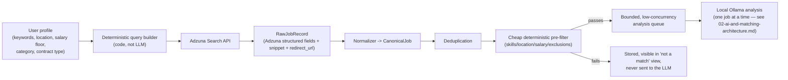
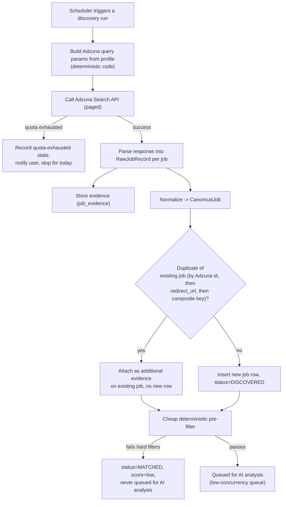
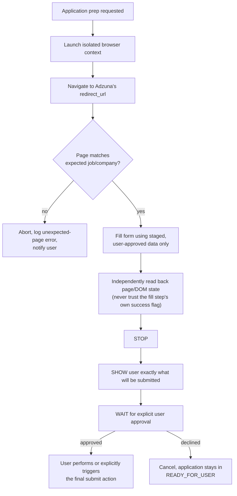

# Job Sources and Browser Automation

## The core rule: Adzuna searches for jobs. The AI does not.

**Adzuna is the mandatory, sole job source for the MVP.** All job discovery — querying, filtering by keyword/location/salary/category, paging through results — is performed by calling Adzuna's REST API with parameters built deterministically from the user's profile. There is no code path, in the MVP or in any later phase, where the LLM is given a "search the web," "find jobs," or "call this API" capability. Search is 100% Adzuna plus deterministic code. The LLM only ever sees jobs *after* Adzuna has already found them and deterministic filtering has already run.

This is a stronger, more specific instance of "don't trust the LLM" (rule 5): it isn't just that the LLM can't be trusted to state facts about a job — it can't be trusted to decide what counts as a candidate job in the first place. That decision belongs to Adzuna's structured, queryable index and to deterministic profile-matching code.

## Adzuna, specifically

Adzuna (`developer.adzuna.com`) is a job-search aggregator with a public REST API. Relevant facts that shape this design:

- **Auth**: an `app_id` + `app_key` pair issued on registration, passed as query parameters on every call. Both are server-side secrets (see `08-security-and-prompt-injection.md`) — never shipped to the frontend.
- **Search endpoint**: country-scoped (e.g. `/v1/api/jobs/{country}/search/{page}`), accepting parameters for keywords, location, salary bounds, category, contract type, and sort order — i.e. every deterministic filter this system needs is expressible as an Adzuna query parameter, not something that needs an LLM to "decide."
- **Response fields** (per job): `id`, `title`, `company`, `location` (structured `area` array + `display_name`), `description` (a snippet — often truncated, not always the full original posting), `salary_min`, `salary_max`, `salary_is_predicted` (Adzuna sometimes estimates rather than states salary — this flag must be surfaced, never silently dropped), `contract_type`, `category`, `created` (posting date), `redirect_url` (the canonical link to the original posting/application page).
- **Other endpoints** (`/histogram`, `/history`, `/top_companies`, `/geodata`, `/categories`) exist for market-analytics use cases; none are required for MVP and none are used unless a later phase has a concrete, documented reason to add them.
- **Rate limits**: Adzuna's developer tier enforces a daily request quota tied to the registered application. The connector treats this quota as configuration (not a hard-coded assumption), respects it, backs off and queues rather than retrying aggressively, and surfaces "Adzuna quota exhausted for today" as an explicit, visible state rather than failing silently or looking like zero jobs exist.
- **`description` is a snippet, not always the full posting.** The connector stores exactly what Adzuna returns — the snippet, all structured fields, and `redirect_url` — as evidence. It does not scrape `redirect_url` to fetch the full original page in the MVP; that would reintroduce the fragility of general-purpose page scraping (site-specific layouts, anti-bot measures) for a benefit (a longer description) that isn't required to ship a reliable MVP. Matching and AI analysis in MVP work against Adzuna's structured fields plus its description snippet. A future phase may add optional full-page extraction via the existing browser-automation subsystem for sources where the snippet is materially insufficient — see `11-mvp-and-roadmap.md`.

## Adzuna wins: structured source data is authoritative over any AI claim

Wherever Adzuna provides a structured field — `salary_min`/`salary_max`, `location`, `contract_type`, `company`, `created`, `redirect_url` — that field is authoritative, full stop. If the LLM's analysis states or implies something different (a different salary figure, a different location, a different employment type), the deterministic layer's value wins and the LLM's conflicting claim is discarded before it ever reaches the user, not merely down-weighted. This is checked mechanically in the Evidence & Verification Layer (`02-ai-and-matching-architecture.md`): any AI-produced factual claim that falls into a category Adzuna already answered structurally is validated directly against the Adzuna field, not against the free-text snippet.

Where Adzuna leaves a field genuinely blank or ambiguous (e.g. `salary_is_predicted: true`, or no salary at all), the LLM may still not invent a value — that case is `UNKNOWN` per the evidence schema below, and `salary_is_predicted` itself is shown to the user as a caveat on any salary that is displayed.

## Source abstraction, retained for future extensibility — but Adzuna is the only implemented adapter in MVP

The system still defines a `JobSourceAdapter` interface (`discover()` → candidate refs, `extract()` → `RawJobRecord`) so that a second source could be added later without rewriting normalization, dedup, matching, or AI analysis. But for the MVP, exactly one adapter is implemented and required: `AdzunaSourceAdapter`. There is no mock adapter, no seeded demo pool, and no second source shipped alongside it "just in case" — one real, working connector is the entire MVP job-discovery surface, per ADR-004.

## Source data vs. normalized data vs. AI analysis — kept separate at all times

| Layer | What it contains | Mutable? |
|---|---|---|
| `RawJobRecord` (source data) | Exactly what Adzuna returned for this job: all structured fields, the description snippet, `redirect_url`, and the timestamp of the call | Immutable once stored |
| `CanonicalJob` (normalized data) | Adzuna's fields mapped into the shared schema; missing fields stay null, never invented; `salary_is_predicted` carried through as a first-class flag | Only re-derived by re-running normalization on new raw data, never hand-edited |
| `AIAnalysis` (AI output) | The LLM's structured, validated, verified interpretation of a `CanonicalJob`, with every claim checked against Adzuna's structured fields first and the description snippet second | Replaced wholesale on re-analysis; never merged/patched in place |

## Job discovery pipeline

- **Deduplication identity order**: (1) Adzuna's own `id`, (2) `redirect_url` (normalized), (3) a documented deterministic fallback composite key (normalized title + company + location). Same inputs always produce the same dedup decision — deterministic code, never LLM-judged.
- **The deterministic pre-filter runs before dedup's output is queued for AI analysis at all** — see `02-ai-and-matching-architecture.md` for exactly what it checks and why it exists (protecting the shared GPU/RAM budget on Wassim's machine, not just cost).

## Browser automation subsystem — application preparation only in MVP scope

Playwright remains part of the architecture for one purpose in MVP: **preparing** an application (navigating to the `redirect_url`/application page, filling fields from staged data) — never submitting one, and never used for job *discovery* (that's Adzuna's job, not automation's). Full-posting extraction via automation is explicitly a possible post-MVP enhancement (`11-mvp-and-roadmap.md`), not required to ship.

**Stop → Show → Wait → Continue is enforced in code**: the automation controller has no code path that calls a submit/confirm control without a persisted "user approved this exact submission" record tied to a specific prepared-application snapshot.

### Safeguards

- **Wrong job/company/CV**: before any form-fill, the controller re-confirms the page's visible job title/company against the `CanonicalJob` (itself anchored to Adzuna's structured fields) and confirms which CV/profile version is staged; mismatches abort.
- **Incorrect form fields**: filled values are read back from the DOM after filling and diffed against intended values before showing the "ready to submit" screen.
- **Unexpected page changes**: adapters declare expected DOM markers; missing markers abort as an error rather than guessing at a different layout.
- **Accidental submission**: submit-shaped controls are never auto-clicked by any code path.
- **Malicious page instructions**: page text is treated purely as data; the automation controller has no natural-language instruction-following pathway at all — see `08-security-and-prompt-injection.md`.

### What the automation subsystem is explicitly not allowed to do

- Search for or discover jobs (that's Adzuna's role, exclusively).
- Create accounts, accept legal/consent agreements, submit an application, message a recruiter, or bypass a captcha/bot-check.
