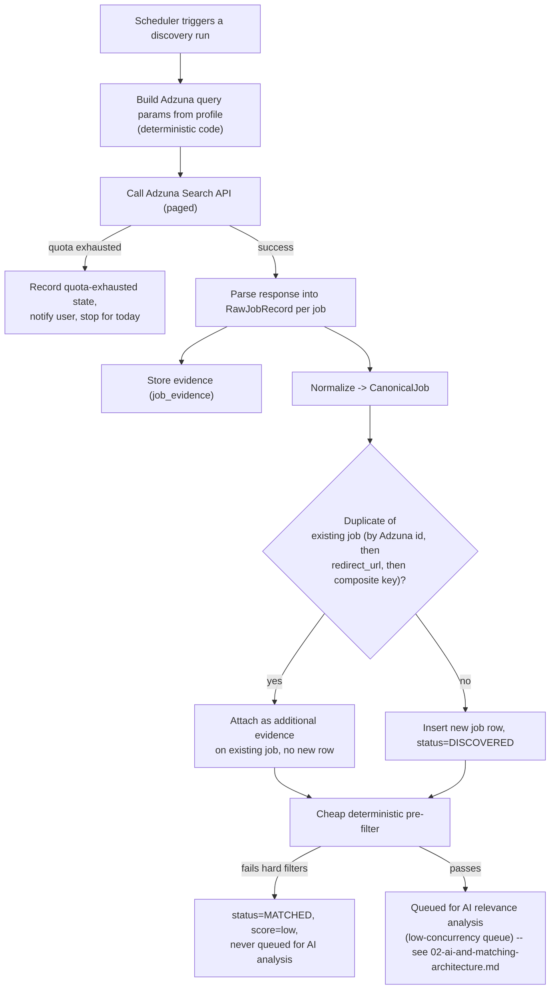
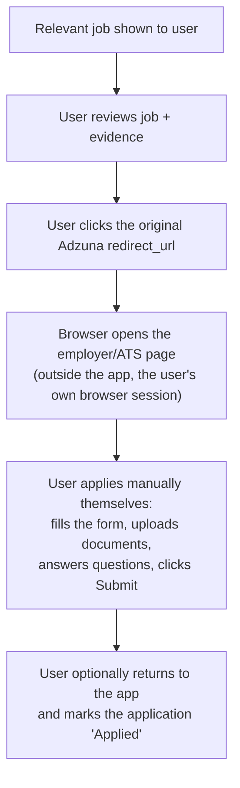
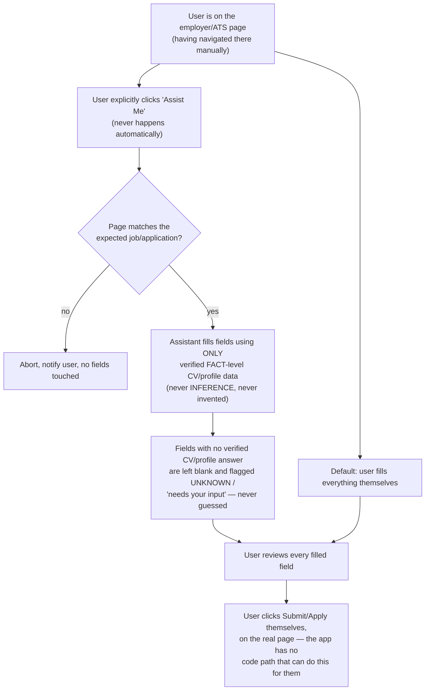

# Job Sources and Application Assistance

## Job search and relevance flow

The ADHD Job Agent — the system as a whole, orchestration code plus the LLM comparison step — actively drives the search-to-relevance loop. What stays fixed regardless of who's "driving" is where job *facts* come from:

```
User search preferences (profile)
  -> AI Job Agent formulates/uses deterministic search criteria
  -> Adzuna API (sole job-data source)
  -> Retrieved jobs (Adzuna's structured fields + snippet, stored as evidence)
  -> Cheap deterministic pre-filter
  -> Local Ollama compares each remaining job against the user's CV/profile
  -> Relevance score + evidence-based explanation
  -> Configurable relevance threshold cutoff
  -> Relevant jobs shown to the user
```

Two things are absolute and don't change based on how this flow is described:

1. **Adzuna is the exclusive source of job facts.** The system never searches the general web for jobs, and the AI never invents a job, URL, company, salary, or requirement. Every job the user sees traces back to a specific Adzuna API response, stored as evidence.
2. **The LLM component itself has no search or tool-calling capability.** It never calls Adzuna, never browses the web, and never decides which jobs exist. Its role begins strictly *after* Adzuna has already returned jobs and the deterministic pre-filter has already run: comparing each remaining job against the CV/profile it's given and producing a scored, evidence-labeled assessment.

An earlier draft of this document said "Adzuna searches for jobs, the AI does not" — that phrasing implied the AI has no role in the search loop at all, which is wrong. The AI Job Agent (the product) *does* drive the end-to-end workflow, including the comparison/scoring step that decides what counts as relevant. What the AI never does is originate job data or bypass Adzuna. See full detail on the comparison/scoring step in `02-ai-and-matching-architecture.md`.

## Adzuna, specifically

Adzuna (`developer.adzuna.com`) is a job-search aggregator with a public REST API. Relevant facts that shape this design:

- **Auth**: an `app_id` + `app_key` pair issued on registration, passed as query parameters on every call. Both are server-side secrets (see `08-security-and-prompt-injection.md`) — never shipped to the frontend.
- **Search endpoint**: country-scoped (e.g. `/v1/api/jobs/{country}/search/{page}`), accepting parameters for keywords, location, salary bounds, category, contract type, and sort order — i.e. every deterministic filter this system needs is expressible as an Adzuna query parameter.
- **Response fields** (per job): `id`, `title`, `company`, `location` (structured `area` array + `display_name`), `description` (a snippet — often truncated, not always the full original posting), `salary_min`, `salary_max`, `salary_is_predicted` (Adzuna sometimes estimates rather than states salary — this flag must be surfaced, never silently dropped), `contract_type`, `category`, `created` (posting date), `redirect_url` (the canonical link to the original posting/application page — this is the link the user manually applies through; see "Manual application, always" below).
- **Other endpoints** (`/histogram`, `/history`, `/top_companies`, `/geodata`, `/categories`) exist for market-analytics use cases; none are required for MVP.
- **Rate limits**: Adzuna's developer tier enforces a daily request quota tied to the registered application. The connector treats this quota as configuration, respects it, backs off and queues rather than retrying aggressively, and surfaces "Adzuna quota exhausted for today" as an explicit, visible state.
- **`description` is a snippet, not always the full posting.** The connector stores exactly what Adzuna returns as evidence. It does not scrape `redirect_url` to fetch the full original page.

## Adzuna wins: structured source data is authoritative over any AI claim

Wherever Adzuna provides a structured field — `salary_min`/`salary_max`, `location`, `contract_type`, `company`, `created`, `redirect_url` — that field is authoritative, full stop. If the LLM's analysis states or implies something different, the deterministic layer's value wins and the LLM's conflicting claim is discarded before it ever reaches the user. This is checked mechanically in the Evidence & Verification Layer (`02-ai-and-matching-architecture.md`).

## Source abstraction, retained for future extensibility — but Adzuna is the only implemented adapter in MVP

The system still defines a `JobSourceAdapter` interface (`discover()` → candidate refs, `extract()` → `RawJobRecord`) so that a second source could be added later without rewriting normalization, dedup, matching, or AI analysis. But for the MVP, exactly one adapter is implemented and required: `AdzunaSourceAdapter`. There is no mock adapter, no seeded demo pool, and no second source shipped alongside it "just in case" — one real, working connector is the entire MVP job-discovery surface, per ADR-004.

## Job discovery pipeline



- **Deduplication identity order**: (1) Adzuna's own `id`, (2) `redirect_url` (normalized), (3) a documented deterministic fallback composite key (normalized title + company + location). Same inputs always produce the same dedup decision — deterministic code, never LLM-judged.
- **The deterministic pre-filter runs before dedup's output is queued for AI analysis at all** — see `02-ai-and-matching-architecture.md` for exactly what it checks and why it exists (protecting the shared GPU/RAM budget on Wassim's machine, not just cost).

## Manual application, always — this is the default and the floor, not an option

**The system never applies for jobs on the user's behalf, in MVP or in any future phase.** This is absolute, not a "no automatic submission without approval" gate that some automated path could eventually satisfy — there is no automated submission path at all, ever.



- The original Adzuna/source URL (`redirect_url`) is preserved and always clearly, prominently accessible from the job detail and application screens — it is the user's route out of the app to actually apply.
- The system does not fill forms, submit applications, use browser automation to apply, upload documents automatically, answer application questions automatically, or interact with an employer's ATS in any way as part of the default flow.
- "Applied" is a status the user sets themselves, after they have manually applied outside the app. It is a user attestation, not a system-verified fact — and that's fine and expected, because it's a direct user action, not an AI or automation self-report (see `02-ai-and-matching-architecture.md`, "Never trust the AI's report," which is specifically about not trusting *machine* self-reports; a user telling the app what they did is authoritative by definition).
- A future phase may add email-monitoring detection of application confirmations (`04-application-lifecycle-and-email.md`) to help notice these events — but that subsystem only ever proposes a detected event for the user to confirm; it never submits anything and never has in this design.

## "Assist Me" — an explicit, opt-in, post-MVP form-filling helper (not in MVP)

The one narrow exception to "the app never touches the ATS" is a strictly opt-in, future-phase assistance feature, not part of MVP: while the user is on the employer's application page (having gotten there themselves via the manual flow above), they may click an explicit **"Assist Me"** action in the app. Only then, and only for that specific application, may an assistant help fill in form fields.



Hard rules for this feature, none of which are negotiable if it's ever built:

- **Never activates itself.** There is no code path that invokes field-filling without that specific, explicit "Assist Me" click for that specific application. It does not pre-fill in the background, does not activate on page load, and does not remember to "help again" without being asked again.
- **Verified data only.** Every value it fills comes from a `FACT`-labeled claim in the user's CV/profile (`02-ai-and-matching-architecture.md`'s claim schema) — the same verified-CV-field discipline used for job matching applies here. If the CV/profile doesn't contain a verified answer for a field, that field is left for the user, explicitly flagged, never guessed or invented.
- **Never touches Submit.** The assistant fills fields; it does not click, trigger, or otherwise activate the application's final submit/apply control, under any circumstance. That action is always a direct, unassisted click by the user on the real page.
- **Never makes decisions.** It does not choose between options on the user's behalf (e.g. answering a judgment-call screening question) beyond inserting a verified fact; anything requiring judgment is left for the user.
- **Page-identity verified before touching anything**, same discipline as any automation in this system: if the visible page doesn't match the expected job/company, it aborts rather than filling blindly.

This is deliberately a much narrower feature than "browser automation prepares an application and the user approves it," which was this document's earlier framing. There is no prepare-then-approve pipeline for submission at all — approval isn't needed because there's nothing automated to approve; the user is always the one physically applying.

## What no version of this system does, ever

- Search the general web for jobs (Adzuna is the exclusive source).
- Invent a job, URL, company, salary, requirement, or qualification.
- Submit an application, click a Submit/Apply control, or otherwise complete the final application step on the user's behalf.
- Create accounts, accept legal/consent agreements, or message a recruiter.
- Activate any form-filling assistance without that specific, explicit user click, or fill a field with anything other than verified CV/profile data.
