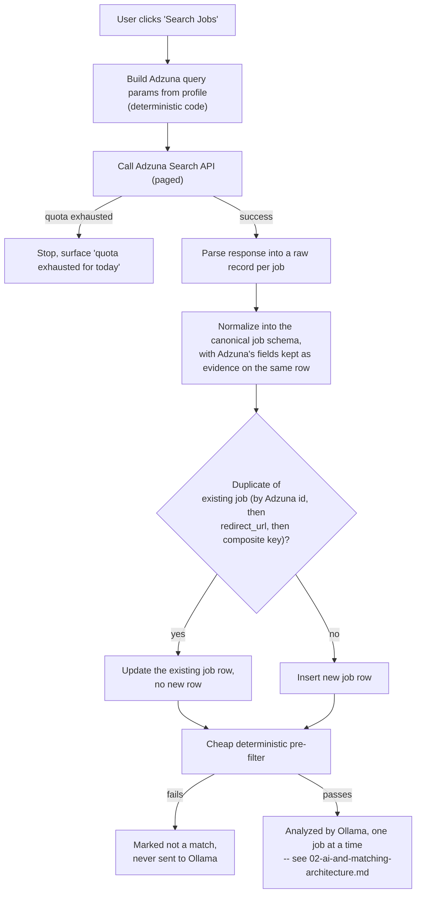

# Job Sources

## Job search and relevance flow

Adzuna is the job search engine. The system as a whole (orchestration code plus the LLM comparison step) drives the discovery-to-relevance pipeline, but every job *fact* comes from one place:

```
User clicks "Search Jobs" (explicit action, no scheduler)
  -> Deterministic search criteria built from the profile
  -> Adzuna API (sole job-data source)
  -> Retrieved jobs (Adzuna's structured fields + snippet, stored as evidence)
  -> Normalize -> Deduplicate
  -> Cheap deterministic pre-filter
  -> Local Ollama analysis model compares each remaining job against the user's CV/profile, one at a time
  -> Relevance score + evidence-based explanation
  -> Relevance threshold cutoff
  -> Relevant jobs shown to the user, each with its original application link
```

Two things are absolute:

1. **Adzuna is the exclusive source of job facts.** The system never searches the general web for jobs, and the AI never invents a job, URL, company, salary, or requirement. Every job the user sees traces back to a specific Adzuna API response, stored as evidence.
2. **The LLM component itself has no search or tool-calling capability.** It never calls Adzuna, never browses the web, and never decides which jobs exist. Its role begins strictly *after* Adzuna has already returned jobs and the deterministic pre-filter has already run: comparing each remaining job against the CV/profile it's given and producing a scored, evidence-labeled assessment. See `02-ai-and-matching-architecture.md` for the full analysis pipeline.

## Adzuna, specifically

Adzuna (`developer.adzuna.com`) is a job-search aggregator with a public REST API. Relevant facts that shape this design:

- **Auth**: an `app_id` + `app_key` pair issued on registration, passed as query parameters on every call. Both are server-side secrets, never shipped to the frontend.
- **Search endpoint**: country-scoped (e.g. `/v1/api/jobs/{country}/search/{page}`), accepting parameters for keywords, location, salary bounds, category, contract type, and sort order — every deterministic filter this system needs is expressible as an Adzuna query parameter.
- **Fields preserved from Adzuna, per job**: Adzuna's own `id`, `title`, `company`, `location` (structured `area` array + `display_name`), `description` (a snippet — often truncated, not always the full original posting), `salary_min`, `salary_max`, `salary_is_predicted` (Adzuna sometimes estimates rather than states salary — this flag must be surfaced, never silently dropped), `contract_type`/employment info when available, `category`, `created` (posting date), `redirect_url` (the canonical link to the original posting/application page — the link the user manually applies through), and basic source metadata (which API call produced this record, when). Wherever Adzuna does not provide a field, it is stored as `UNKNOWN`/null — never invented.
- **Other endpoints** (`/histogram`, `/history`, `/top_companies`, `/geodata`, `/categories`) exist for market-analytics use cases; none are required for MVP.
- **Rate limits**: Adzuna's developer tier enforces a daily request quota tied to the registered application. The connector treats this quota as configuration, respects it, and if exhausted mid-search simply stops and surfaces "Adzuna quota exhausted for today" as an explicit, visible state to the user — no retry queue, since a search is a single user-triggered request, not a background job.
- **`description` is a snippet, not always the full posting.** The connector stores exactly what Adzuna returns as evidence. It does not scrape `redirect_url` to fetch the full original page.

## Adzuna wins: structured source data is authoritative over any AI claim

Wherever Adzuna provides a structured field — `salary_min`/`salary_max`, `location`, `contract_type`, `company`, `created`, `redirect_url` — that field is authoritative, full stop. If the analysis model's output states or implies something different, the deterministic layer's value wins and the model's conflicting claim is discarded before it ever reaches the user. This is checked mechanically in the evidence verification step (`02-ai-and-matching-architecture.md`).

## Source abstraction, retained for future extensibility — but Adzuna is the only implemented adapter

The system still defines a `JobSourceAdapter` interface (`discover()` → candidate refs, `extract()` → `RawJobRecord`) so that a second source could be added later without rewriting normalization, dedup, filtering, matching, or AI analysis. For now, exactly one adapter is implemented and required: `AdzunaSourceAdapter`. There is no mock adapter and no seeded demo pool — one real, working connector is the entire job-discovery surface.

## Job discovery pipeline



- **Deduplication identity order**: (1) Adzuna's own `id`, (2) `redirect_url` (normalized), (3) a documented deterministic fallback composite key (normalized title + company + location). Same inputs always produce the same dedup decision — deterministic code, never LLM-judged.
- **The deterministic pre-filter runs before a job is ever sent to Ollama** — see `02-ai-and-matching-architecture.md` for exactly what it checks and why it exists (protecting the shared GPU/RAM budget, not just cost).

## Where the system's involvement ends

Once a job is scored above the relevance threshold, it is shown to the user with its evidence, its score breakdown, and Adzuna's `redirect_url`. The user reviews it and, if interested, clicks that original link, which opens the employer or ATS page. **That is the end of this system's involvement.** The user applies manually, entirely outside the app. The system does not open a browser automatically, does not fill any form, does not upload any document, does not click Apply or Submit, and does not track what happens after the click. There is no in-app concept of "applied," "in progress," or "rejected" — job discovery, filtering, and relevance scoring are the whole product. Tracking what happens after a user applies is explicitly outside this project's scope; the user handles that separately, elsewhere.

## What this system does not do, ever

- Search the general web for jobs (Adzuna is the exclusive source).
- Invent a job, URL, company, salary, requirement, or qualification.
- Open a browser automatically, fill an application form, upload a document, or click Apply/Submit on the user's behalf, in any form, under any name.
- Track application status, application history, or any post-click outcome.
- Monitor email for application-related messages.
