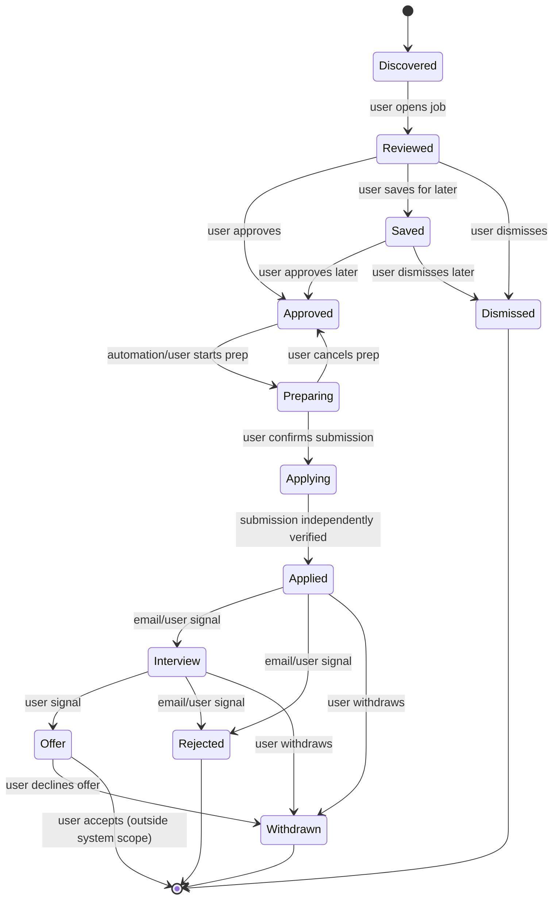
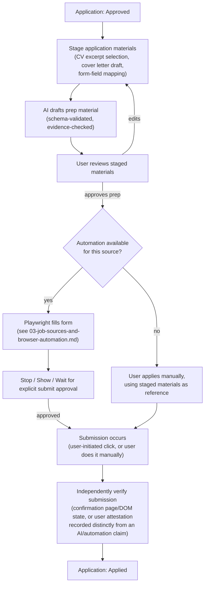
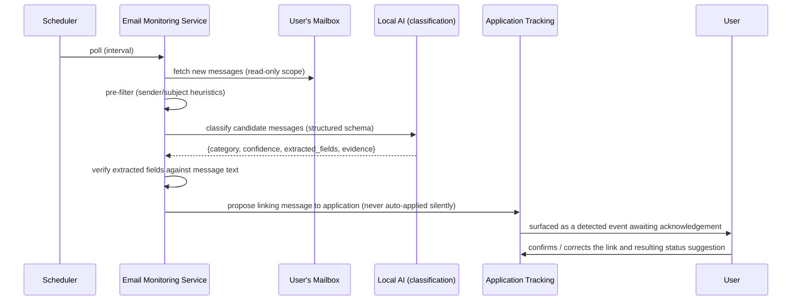

# Application Lifecycle and Email Monitoring

## Application state model

Chosen by combining prototype 1's discovery/review states (evaluation side) with prototype 2's application-pipeline states (post-approval side), extended with explicit preparation and terminal states, since neither prototype alone covered the full journey end to end.

- **Discovered → Reviewed → Approved/Saved/Dismissed** covers the triage journey (from prototype 1's evaluation states, simplified for a UI-driven single user instead of a CLI/CSV pipeline).
- **Approved → Preparing → Applying → Applied** makes prototype 2's implicit "user marks Applied manually" step explicit and auditable, and is where browser automation and the Stop→Show→Wait→Continue rule live.
- **Applied → Interview/Rejected → Offer/Withdrawn** matches prototype 2's post-application pipeline, trimmed of the "Screening" state (folded into Applied, since screening is not independently observable without ATS-specific signals prototype 2 never implemented) to avoid a state the system can't actually detect a transition into/out of.
- Every arrow is a recorded `application_events` row (see `06-database-design.md`), whether triggered by the user, an automation step, or a detected email — nothing changes status silently.

## Application preparation and submission flow

Note the same rule from `02-ai-and-matching-architecture.md` applies here: a "submitted successfully" message from the automation layer is not, by itself, sufficient to flip status to `Applied`. The system checks for an independent signal (a confirmation page element, a confirmation email later matched by email monitoring, or an explicit user attestation click that is logged as a *user* action, not inferred from automation output).

## Email monitoring

A separate, narrowly-scoped subsystem. It reads a connected mailbox (via a standard mail API/IMAP with read-only or minimally-scoped access), classifies messages, and links relevant ones to existing applications. It does not manage the mailbox.

- **Categories detected**: application confirmation, interview invitation, rejection, request for more information, recruiter outreach, general hiring-process update.
- **Never deletes email.** Read and label/tag only, if the provider supports non-destructive tagging; otherwise purely internal record-keeping with no mailbox mutation at all.
- **Never acts on instructions inside an email.** Email content is classified as data through the same untrusted-input path as job postings (see `08-security-and-prompt-injection.md`) — a message that says "click here to confirm" or "reply with your SSN" is inert to this subsystem; it can only ever produce a classification-with-evidence for the user to see.
- **Association, not auto-transition.** Detecting "this looks like a rejection for the Acme Corp application" creates a proposed event the user sees and confirms on their dashboard (fits the ADHD-friendly "here's what I noticed, what do you want to do" pattern) rather than silently flipping status — matching rule 8 (Human Approval) for anything consequential, while still doing the tedious reading-and-matching work for the user.
- **Evidence preserved**: the original message ID/reference and the exact excerpt that triggered classification are stored, so the user (or a later audit) can see why the system thought a message was relevant.

## Notifications

The notification service is a thin layer over the same events already recorded (`application_events`, new high-scoring `job_matches`, unconfirmed `email_events`) — it does not introduce a second source of truth. It surfaces, at most, a small daily-relevant set: new strong matches, applications with a pending action, and unconfirmed detected email events. It deliberately does not attempt to become a general-purpose alerting system.
