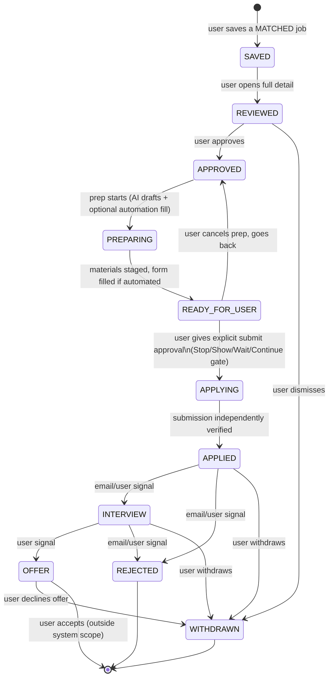
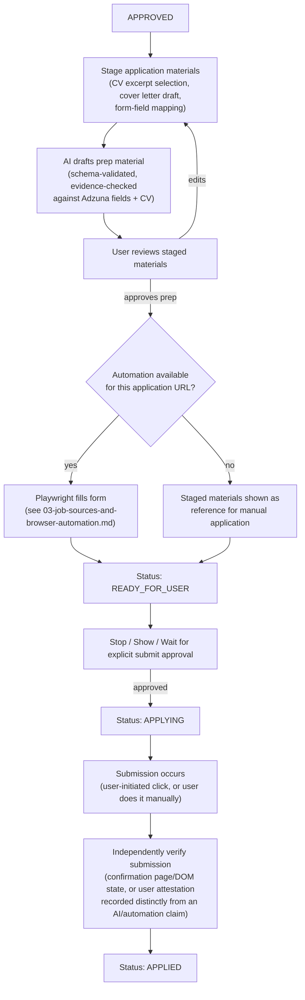
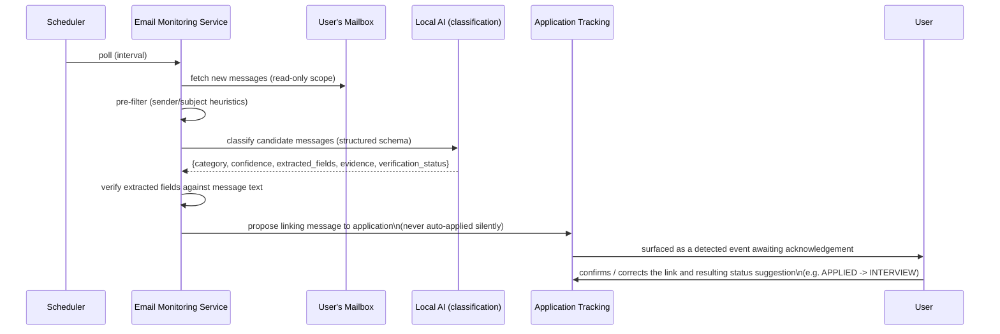

# Application Lifecycle and Email Monitoring

## Two separate state machines, not one overloaded one

This revision separates two things that the first version of this spec conflated into one job-status enum: the **deterministic ingestion pipeline status** (owned entirely by code, never by the user) and the **application lifecycle** (owned by the user's journey with a specific job they've taken an interest in).

- **`jobs.status`** — deterministic pipeline state, set only by ingestion/normalization/dedup/matching code: `DISCOVERED → NORMALIZED → (DUPLICATE | MATCHED) → (ERROR on failure)`. A job never moves through these because of anything the user or the LLM does; it moves because Adzuna returned it and code processed it.
- **`applications.status`** — the user-facing lifecycle, created the moment a user takes a first interest action ("Save") on a `MATCHED` job. This is the exact 11-state list:

```
SAVED, REVIEWED, APPROVED, PREPARING, READY_FOR_USER, APPLYING, APPLIED, INTERVIEW, OFFER, REJECTED, WITHDRAWN
```

This split removes the redundancy the first version had (a `saved_jobs` table plus overlapping job-status values) — saving a job *is* creating an application row in `SAVED` status; there is no separate saved-jobs concept anymore.



- **`READY_FOR_USER` is the Stop→Show→Wait→Continue gate materialized as a real, queryable state**, not just a UI modal — an application can sit in `READY_FOR_USER` indefinitely (e.g. the user gets distracted, closes the app, comes back tomorrow) and the system's database is the source of truth for "this is staged and waiting for you," which fits the ADHD-friendly "resume where I left off" need directly.
- Every arrow above is a recorded `application_events` row (see `06-database-design.md`), whether triggered by the user, an automation step, or a detected email — nothing changes status silently.
- Invalid transitions (e.g. `SAVED → APPLIED` directly) are rejected at the database and application layer alike (see `09-testing-strategy.md`).

## Application preparation and submission flow



A "submitted successfully" message from the automation layer is never, by itself, sufficient to flip status to `APPLIED`. The system requires an independent signal (a confirmation page element, a confirmation email later matched by email monitoring, or an explicit user attestation click logged as a *user* action, not inferred from automation output) — same rule as `02-ai-and-matching-architecture.md`, applied here.

## Email monitoring

Unchanged in shape from the first version, retargeted to the new state names: a narrowly-scoped subsystem that reads a connected mailbox (read-only/minimal scope), classifies messages, and proposes linking them to an existing `applications` row — never auto-transitioning status without user confirmation.



- **Categories detected**: application confirmation, interview invitation, rejection, request for more information, recruiter outreach, general hiring-process update.
- **Never deletes email.** Read and label/tag only, if the provider supports non-destructive tagging.
- **Never acts on instructions inside an email.** Same untrusted-input treatment as job postings — see `08-security-and-prompt-injection.md`.
- **Association, not auto-transition.** A detected event proposes a status change (e.g. suggesting `APPLIED → INTERVIEW`); the user confirms or corrects it.
- **Evidence preserved**: the original message reference and the exact excerpt that triggered classification are stored.

## Notifications

Unchanged: a thin surface over `application_events`, new `MATCHED` jobs above the score threshold, and unconfirmed `email_events` — no second source of truth, no general-purpose alerting ambition.
