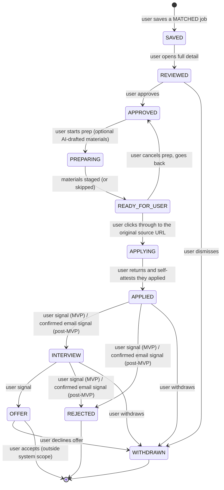
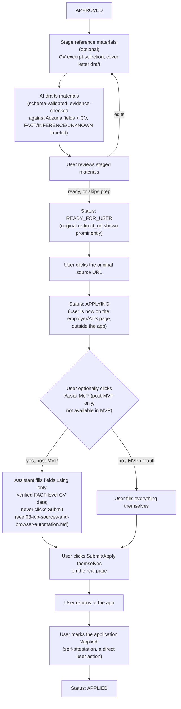
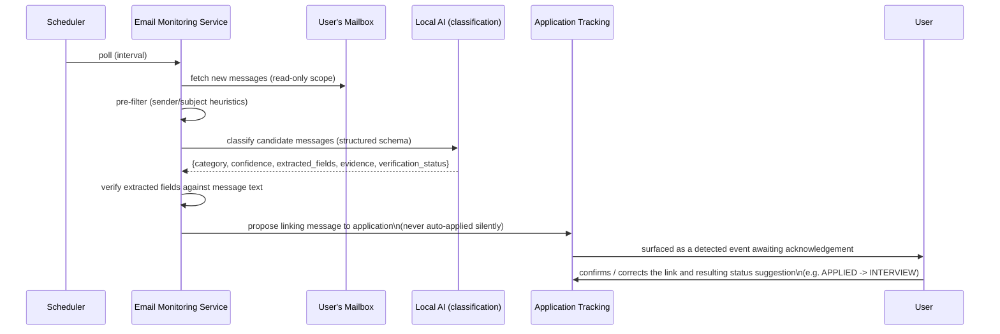

# Application Lifecycle and Email Monitoring

## Two separate state machines, not one overloaded one

- **`jobs.status`** — deterministic pipeline state, set only by ingestion/normalization/dedup/matching code: `DISCOVERED → NORMALIZED → (DUPLICATE | MATCHED) → (ERROR on failure)`. A job never moves through these because of anything the user or the LLM does; it moves because Adzuna returned it and code processed it.
- **`applications.status`** — the user-facing lifecycle, created the moment a user takes a first interest action ("Save") on a `MATCHED` job. Exact 11-state list (unchanged):

```
SAVED, REVIEWED, APPROVED, PREPARING, READY_FOR_USER, APPLYING, APPLIED, INTERVIEW, OFFER, REJECTED, WITHDRAWN
```

## What every state means now — all MVP transitions are user-driven, manual actions

There is no automated submission anywhere in this system (`03-job-sources-and-browser-automation.md`). Every transition from `APPROVED` onward is either a direct user click or (post-MVP, for `APPLIED → INTERVIEW/REJECTED`) a user-confirmed detected email event — never an automation- or AI-triggered status change.

| State | Meaning | How it's reached |
|---|---|---|
| `SAVED` | User saved a `MATCHED` job | User action |
| `REVIEWED` | User opened the full job detail | User action |
| `APPROVED` | User decided to pursue this job | User action |
| `PREPARING` | (Optional) AI is drafting reference materials — CV excerpt highlights, a cover-letter draft — evidence-based, schema-validated, never sent anywhere | User-initiated; MVP includes this step as staged materials only, no automation |
| `READY_FOR_USER` | Materials (if any) are staged; the original Adzuna `redirect_url` is prominently displayed | Automatic once prep finishes, or immediate if the user skips prep |
| `APPLYING` | User has clicked through to the original source URL and is now applying on the employer/ATS site, in their own browser, outside the app | User action (click-through) |
| `APPLIED` | User has manually applied and returned to self-attest | User action (self-attestation — see below) |
| `INTERVIEW` / `REJECTED` / `OFFER` / `WITHDRAWN` | Outcome tracking | User action in MVP; post-MVP, email monitoring may propose these, always pending user confirmation |



- Every arrow above is a recorded `application_events` row, whether triggered by the user or (post-MVP only) a confirmed detected email — nothing changes status silently.
- Invalid transitions (e.g. `SAVED → APPLIED` directly) are rejected at the database and application layer alike (see `09-testing-strategy.md`).

## Application preparation and manual-apply flow



A note on trust here: `APPLIED` is set entirely from the user's own action, not from any AI or automation claim. The "never trust a self-reported action" rule (ADR-002, `02-ai-and-matching-architecture.md`) governs *machine* self-reports — an AI or automation component claiming something happened. It does not apply to the user's own direct actions inside their own app; when the user clicks "Mark as Applied," that click *is* the fact, recorded as a `user`-actor event, not a claim requiring independent verification. There is nothing left for the system to verify, because the system was never the one applying.

## Email monitoring (post-MVP)

**Not part of MVP.** A narrowly-scoped, future-phase subsystem that reads a connected mailbox (read-only/minimal scope), classifies messages, and proposes linking them to an existing `applications` row — never auto-transitioning status without user confirmation, and never submitting anything.



- **Categories detected**: application confirmation, interview invitation, rejection, request for more information, recruiter outreach, general hiring-process update.
- **Never deletes email.** Read and label/tag only, if the provider supports non-destructive tagging.
- **Never acts on instructions inside an email.** Same untrusted-input treatment as job postings — see `08-security-and-prompt-injection.md`.
- **Association, not auto-transition, and never submission.** A detected event proposes a status change (e.g. suggesting `APPLIED → INTERVIEW`); the user confirms or corrects it. This subsystem has no capability to submit an application and never has in this design — it only ever reads and classifies mail the user already received after applying manually.
- **Evidence preserved**: the original message reference and the exact excerpt that triggered classification are stored.

## Notifications

A thin surface over `application_events`, new `MATCHED` jobs above the relevance threshold, and (post-MVP) unconfirmed `email_events` — no second source of truth, no general-purpose alerting ambition.
