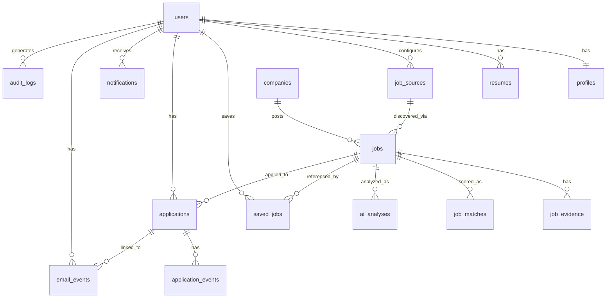

# Database Design

PostgreSQL, via self-hosted Supabase (see `10-deployment-and-dev-workflow.md` for exactly which Supabase parts are used). Every table is owned by the single application user via `user_id`; row-level security policies enforce isolation as defense-in-depth even though the primary access path is the backend service, which performs its own authorization checks (see `08-security-and-prompt-injection.md`).

## Entity relationships

## Tables

- **users** — single application user (or a small handful, though the product is designed single-user). Managed by the auth provider; the app's `users` row mirrors the auth subject ID plus app-level fields (created_at, timezone, notification prefs pointer).
- **profiles** — one row per user: professional summary, desired roles, preferred/excluded skills, preferred locations, work-mode acceptance, employment-type preference, salary target/minimum, seniority, scoring-weight overrides. This is the deterministic matching engine's primary input (see `02-ai-and-matching-architecture.md`).
- **resumes** — uploaded resume files (private object storage reference) plus parsed structured content (experience, education, skills, certifications extracted once at upload time, editable by the user). One resume marked `is_active` at a time; others retained for history/versioned prep material.
- **companies** — deduplicated company records (name, canonical domain, industry) referenced by `jobs`, avoiding re-storing company info per job.
- **job_sources** — configured source connectors (type: api/page/browser, config JSON, enabled flag, last-run metadata). One row per configured source instance.
- **jobs** — the canonical, deduplicated job record: title, company_id, location, work_mode, employment_type, salary_min/max/currency, description (normalized text), requirements, skills, status (Discovered/Reviewed/Approved/...), posted_at, discovered_at, updated_at. This is the `CanonicalJob` from `03-job-sources-and-browser-automation.md`. Nullable wherever a source doesn't provide a field — never backfilled with an invented value.
- **job_evidence** — one or more rows per job: source_id (fk to job_sources), source_url, raw_text, raw_html_snapshot (optional, object storage reference for large snapshots), extracted_at. Preserves exactly what each source gave, independent of normalization.
- **job_matches** — one row per job (recomputed on profile change or job update): deterministic sub-scores per factor, final transparent score, factor breakdown (JSONB), computed_at. Pure deterministic-layer output — the `B` in the A/B/C/D model.
- **ai_analyses** — one row per AI analysis run on a job: model_used, prompt_version, raw_validated_response (JSONB, post-schema-validation), verification_result (JSONB: which claims verified/inferred/unknown and why), status (success/rejected/ai_unavailable), created_at. Never overwritten in place — a re-analysis inserts a new row, keeping history.
- **saved_jobs** — user's saved-for-later jobs (job_id, user_id, saved_at, note).
- **applications** — one row per application: job_id, user_id, status (per the state machine in `04-application-lifecycle-and-email.md`), applied_at, next_action, follow_up_date, notes.
- **application_events** — append-only audit trail of every status transition and material action on an application: event_type, actor (user/automation/email_detection), description, evidence_reference, created_at. This table is what makes every transition traceable, per the spec's audit requirement.
- **email_events** — detected email classifications: message_reference (not full message body unless user opts to store it), category, confidence, extracted_fields (JSONB), evidence_excerpt, linked_application_id (nullable until confirmed), user_confirmed (bool), created_at.
- **notifications** — surfaced items (type, reference to source record, read/dismissed state, created_at). Derived/denormalized from the tables above for fast "what needs attention" queries; not an independent source of truth.
- **audit_logs** — append-only system-wide log: actor, action_type, target_table/target_id, outcome, metadata (JSONB, no secrets ever), created_at. Covers AI calls, automation steps, and anything not already fully captured by `application_events`/`ai_analyses`.

Tables deliberately **not** included: no separate "companies research" table (folded into `companies` + `job_evidence`), no generic polymorphic "activities" table replacing the more specific `application_events`/`audit_logs`/`email_events` (kept distinct because each has different retention, sensitivity, and query needs), no multi-tenant/organization tables (single-user product).

## Ownership rule

Every table above except `companies`, `jobs`, `job_sources`-shared-lookups, and `job_evidence`/`job_matches`/`ai_analyses` (which are owned indirectly through their parent `job`, itself discovered by a user-configured `job_source`) carries a direct `user_id`. Authorization checks in the backend, and RLS policies in Postgres, both key off this column — see `08-security-and-prompt-injection.md` for the exact policy pattern (the same one-policy-per-CRUD-verb pattern prototype 2 used, since it's simple, explicit, and avoids `USING (true)` shortcuts).
