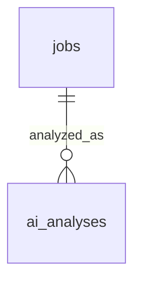

# Database Design

**SQLite**, a single local file. This is a single-user, single-machine application: there is no case here for a database server, connection pooling, or row-level security. The database stores only what the application actually needs.

This replaces an earlier version of this design built on self-hosted Supabase (PostgreSQL + GoTrue Auth + Storage). That stack solved problems this project doesn't have — multiple users, network-exposed auth, a separate object-storage service — and is dropped in favor of one file and no auth service (see ADR-005, `01-architecture-overview.md`).

## Tables — exactly three

`profile` isn't shown in the diagram because it has no foreign-key relationship to anything — it's a single row read by the matching and AI steps, not joined against.

- **profile** — one row. Work experience, technical skills, networking/cybersecurity/sysadmin experience, education, certifications, languages, desired roles/keywords (used to build the Adzuna query), location preferences, salary requirements, remote/hybrid/on-site preference, experience level, excluded keywords, relevance-score threshold, resume text/file path. Any field left blank is `UNKNOWN`/not demonstrated for matching purposes, never inferred.
- **jobs** — one row per canonical, deduplicated job, sourced from Adzuna: `adzuna_id`, title, company, location, work_mode, employment_type, salary_min/max/currency, `salary_is_predicted`, description (Adzuna's snippet), requirements, skills, `redirect_url`, posted_at, discovered_at, `raw_evidence` (JSON — exactly what Adzuna returned for this job, kept alongside the normalized fields instead of in a separate evidence table), `passed_prefilter` (bool). Nullable wherever Adzuna doesn't provide a field — never backfilled with an invented value.
- **ai_analyses** — one row per AI analysis run on a job: `job_id`, model_used (the exact pinned analysis-model tag), `score`, `recommendation`, `confidence`, `matching_skills` (JSON), `matching_experience` (JSON), `missing_requirements` (JSON), `unknown_requirements` (JSON), `explanation`, `evidence` (JSON), `status` (`success | rejected | ai_unavailable`), `created_at`. A re-analysis inserts a new row rather than overwriting.

## What is deliberately not in the database

- No `users` table and no auth tables — single local user, no login for the MVP (`01-architecture-overview.md`).
- No `companies` table — company name/details are stored directly on the `jobs` row; a separate table for deduplicated company records is a relationship this single-user scale doesn't need.
- No `job_evidence` table — Adzuna's raw response for a job lives in that job's own `raw_evidence` column.
- No `job_matches` table — the deterministic pre-filter's outcome is the `passed_prefilter` flag on `jobs`; there's no separate deterministic-scoring table because there's no configurable weighting framework producing a multi-factor breakdown to store (`02-ai-and-matching-architecture.md`).
- No `saved_jobs`/bookmark table for the MVP — the results of the last search are what the Jobs/Search screen shows; a persistent bookmark list is not built until it's genuinely needed.
- No `applications`, `application_events`, or `email_events` table — application tracking and email monitoring are not part of this project.
- No `audit_logs` table — application-level logging (to a log file, if needed for debugging) is an operational concern, not a database table, at this scale.

## Migrations

A minimal migration tool appropriate for SQLite (e.g. Alembic configured for SQLite, or a small hand-rolled versioned-SQL-file runner) tracks schema changes. No blue/green or zero-downtime migration tooling — a single-user local app can be restarted for a schema change.
