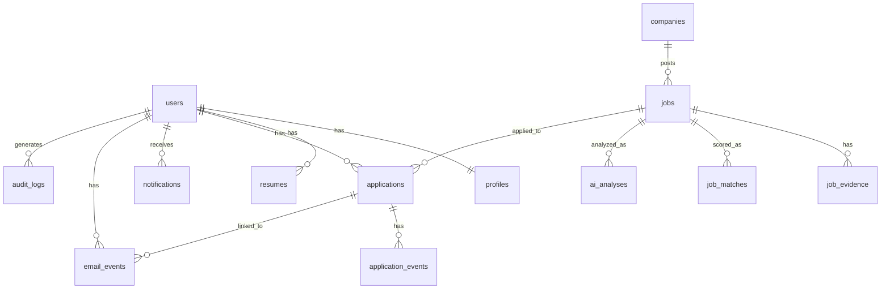

# Database Design

PostgreSQL, via self-hosted Supabase (see `10-deployment-and-dev-workflow.md`). Every table is owned by the single application user via `user_id`; row-level security policies enforce isolation as defense-in-depth (see `08-security-and-prompt-injection.md`).

## Entity relationships

Note relative to the first version: there is no `job_sources` table and no `saved_jobs` table. **`job_sources` is removed** — Adzuna is the sole, mandatory MVP source (`03-job-sources-and-browser-automation.md`, ADR-004) and its connection config (app_id/app_key, query defaults) lives in server-side application configuration, not a user-editable database table, since there is nothing for the user to configure among multiple sources in MVP. **`saved_jobs` is removed** — saving a job now creates an `applications` row in `SAVED` status (`04-application-lifecycle-and-email.md`), so a separate saved-jobs concept would be redundant.

## Tables

- **users** — the application user. Managed by the auth provider; the app's `users` row mirrors the auth subject ID plus app-level fields (created_at, timezone, notification prefs pointer).
- **profiles** — one row per user: professional summary, desired roles/keywords (used to build Adzuna query parameters), preferred/excluded skills, preferred locations, work-mode acceptance, employment-type preference, salary target/minimum, seniority, scoring-weight overrides.
- **resumes** — uploaded resume files (private object storage reference) plus parsed structured content. One resume marked `is_active` at a time.
- **companies** — deduplicated company records (name, canonical domain if known, industry) referenced by `jobs`.
- **jobs** — the canonical, deduplicated job record, sourced exclusively from Adzuna in MVP: `adzuna_id`, title, company_id, location, work_mode, employment_type, salary_min/max/currency, `salary_is_predicted` (bool, carried through from Adzuna, never dropped), description (Adzuna's snippet), requirements, skills, `redirect_url`, **`status`** (pipeline-only: `DISCOVERED | NORMALIZED | DUPLICATE | MATCHED | ERROR` — never set by the user or the LLM), posted_at (Adzuna's `created`), discovered_at, updated_at. Nullable wherever Adzuna doesn't provide a field — never backfilled with an invented value.
- **job_evidence** — one or more rows per job: `source_name` (fixed `"adzuna"` in MVP), source call parameters, raw Adzuna response fields, `redirect_url`, `extracted_at`. Preserves exactly what Adzuna returned, independent of normalization.
- **job_matches** — one row per job (recomputed on profile change or job update): deterministic sub-scores per factor, `passed_prefilter` (bool — whether this job was ever eligible to reach the LLM at all, per `02-ai-and-matching-architecture.md`), final transparent score, factor breakdown (JSONB), computed_at.
- **ai_analyses** — one row per AI analysis run on a job: model_used (the exact pinned tag, e.g. `qwen2.5:14b-instruct-q4_K_M`), prompt_version, `claims` (JSONB array of `{claim, claim_type, verification_status, source_excerpt, confidence}` per `02-ai-and-matching-architecture.md`), concerns, explanation, status (`success | rejected | ai_unavailable`), created_at. Never overwritten in place — a re-analysis inserts a new row.
- **applications** — one row per application, created at first user interest ("Save"): job_id, user_id, **`status`** (the 11-value application lifecycle from `04-application-lifecycle-and-email.md`: `SAVED | REVIEWED | APPROVED | PREPARING | READY_FOR_USER | APPLYING | APPLIED | INTERVIEW | OFFER | REJECTED | WITHDRAWN`), applied_at, next_action, follow_up_date, notes.
- **application_events** — append-only audit trail of every status transition and material action on an application: event_type, actor (`user | automation | email_detection`), description, evidence_reference, created_at.
- **email_events** — detected email classifications: message_reference, category, confidence, extracted_fields (JSONB), evidence_excerpt, `linked_application_id` (nullable until confirmed), user_confirmed (bool), created_at.
- **notifications** — surfaced items (type, reference to source record, read/dismissed state, created_at). Derived from the tables above, not an independent source of truth.
- **audit_logs** — append-only system-wide log: actor, action_type, target_table/target_id, outcome, metadata (JSONB, no secrets ever), created_at.

## Application status transition guard

A database-level check (trigger or constraint, matching prototype 2's proven pattern of guarding invalid jumps) enforces that `applications.status` can only move along the edges in the state diagram in `04-application-lifecycle-and-email.md` — e.g. `SAVED → APPLIED` directly is rejected at the database layer, not just the API layer, as defense-in-depth.

## Ownership rule

Every table above except `companies`, `jobs`, and `jobs`-owned children (`job_evidence`, `job_matches`, `ai_analyses`, indirectly owned since the job itself has no single-user column — jobs discovered via Adzuna are shared factual records, not user-private data, in the same way a public job posting isn't private) carries a direct `user_id`. Authorization checks in the backend, and RLS policies in Postgres, both key off this column — one-policy-per-CRUD-verb pattern, no `USING (true)` shortcuts on user-owned data (`08-security-and-prompt-injection.md`).
