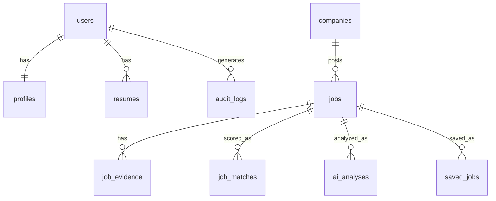

# Database Design

PostgreSQL, via self-hosted Supabase (see `10-deployment-and-dev-workflow.md`). Every table is owned by the single application user via `user_id`; row-level security policies enforce isolation as defense-in-depth.

## Entity relationships

Note relative to earlier versions of this design: there is no `job_sources` table (Adzuna is the sole source, and its connection config lives in server-side application configuration, not a user-editable table). There is no `applications`, `application_events`, or `email_events` table — application tracking and email monitoring are not part of this project (see `00-vision-and-requirements.md`, non-goals). `saved_jobs` is a simple bookmark table, not a status/lifecycle object.

## Tables

- **users** — the application user. Managed by the auth provider; the app's `users` row mirrors the auth subject ID plus app-level fields (created_at, timezone).
- **profiles** — one row per user, holding the explicit CV/preference field categories that drive both Adzuna query building and AI matching (`02-ai-and-matching-architecture.md`): work experience (structured entries: title, employer, dates, description), technical skills, networking experience, cybersecurity experience, sysadmin experience, education, certifications, languages, desired roles/keywords (used to build Adzuna query parameters), location preferences, salary requirements (target/minimum), remote/hybrid/on-site preference, experience level/seniority, excluded skills/companies, scoring-weight overrides, relevance-score threshold. Any field left blank by the user is `UNKNOWN`/not demonstrated for matching purposes, never inferred or assumed.
- **resumes** — uploaded resume files (private object storage reference) plus parsed structured content mapped into the same field categories as `profiles`. One resume marked `is_active` at a time.
- **companies** — deduplicated company records (name, canonical domain if known, industry) referenced by `jobs`.
- **jobs** — the canonical, deduplicated job record, sourced exclusively from Adzuna: `adzuna_id`, title, company_id, location, work_mode, employment_type, salary_min/max/currency, `salary_is_predicted` (bool, carried through from Adzuna, never dropped), description (Adzuna's snippet), requirements, skills, `redirect_url`, posted_at (Adzuna's `created`), discovered_at, updated_at. Nullable wherever Adzuna doesn't provide a field — never backfilled with an invented value.
- **job_evidence** — one or more rows per job: `source_name` (fixed `"adzuna"`), source call parameters, raw Adzuna response fields, `redirect_url`, `extracted_at`. Preserves exactly what Adzuna returned, independent of normalization.
- **job_matches** — one row per job (recomputed on profile change or job update): deterministic sub-scores per factor, `passed_prefilter` (bool — whether this job was ever eligible to reach the analysis model at all, per `02-ai-and-matching-architecture.md`), final transparent score, factor breakdown (JSONB), computed_at.
- **ai_analyses** — one row per AI analysis run on a job: model_used (the exact currently-pinned analysis-model tag, e.g. `qwen2.5:14b-instruct-q4_K_M` — see `14-model-evaluation.md` for its candidate/benchmark status), prompt_version, `score`, `recommendation`, `confidence`, `matching_skills` (JSONB array, each item evidence-labeled FACT/INFERENCE/UNKNOWN with `source_excerpt`), `matching_experience` (same shape), `missing_requirements` (JSONB array), `unknown_requirements` (JSONB array), `explanation`, `evidence` (JSONB array, same shape as matching_skills), status (`success | rejected | ai_unavailable`), created_at. Never overwritten in place — a re-analysis inserts a new row.
- **saved_jobs** — a simple bookmark: user_id, job_id, saved_at, optional note. No status field, no lifecycle, no history beyond saved/not saved.
- **audit_logs** — append-only log: actor, action_type (AI call, Adzuna call), target_table/target_id, outcome, metadata (JSONB, no secrets ever), created_at.

## Ownership rule

Every table above except `companies`, `jobs`, and `jobs`-owned children (`job_evidence`, `job_matches`, `ai_analyses` — indirectly owned since the job itself has no single-user column; jobs discovered via Adzuna are shared factual records, not user-private data, in the same way a public job posting isn't private) carries a direct `user_id`. Authorization checks in the backend, and RLS policies in Postgres, both key off this column — one-policy-per-CRUD-verb pattern, no `USING (true)` shortcuts on user-owned data.
