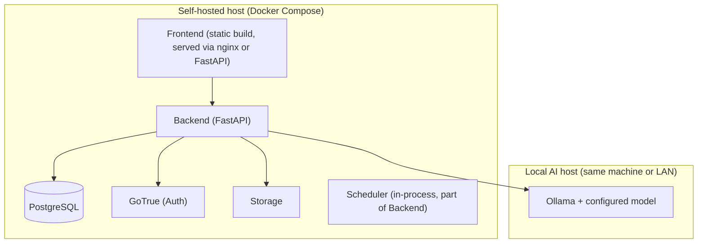

# Technology Stack, Deployment, and Development Workflow

## Technology stack (decisive, one primary choice per concern)

| Concern | Choice | Why |
|---|---|---|
| Backend / API | Python 3.12 + FastAPI | Reuses prototype 1's already-proven Python pipeline logic (canonical job model, Pydantic schemas, CSV/DB store, Ollama client, Playwright automation) instead of rewriting it in another language; Pydantic gives first-class request/response and AI-schema validation, which is central to this system's evidence/verification requirements; async support suits I/O-bound job discovery and AI calls. |
| Data validation / schemas | Pydantic v2 | Same library used for API models, canonical job schema, and AI response schemas — one validation approach throughout, not three. |
| Frontend | React 18 + TypeScript + Vite + Tailwind CSS | Directly reuses prototype 2's proven, already-ADHD-oriented frontend architecture and component approach; React Router for the small fixed set of screens in `05-adhd-ux.md`; Tailwind for fast, consistent styling without a heavy design-system dependency. |
| Database | PostgreSQL | Relational data with clear ownership, needs JSONB for AI-analysis payloads and full-text search for job content — no need for a specialized document/search store at this scale. |
| Auth | Supabase Auth (GoTrue), self-hosted | Mature, well-tested email/password + JWT implementation; avoids hand-rolling auth; self-hosted via Supabase's open-source Docker stack, so it is not a dependency on Supabase's hosted cloud service. |
| Object storage | Supabase Storage, self-hosted | Same open-source stack as above, used only for resumes and (optionally) large evidence snapshots; private buckets, signed URLs. |
| Local AI runtime | Ollama | The spec's absolute requirement; runs the configured local model (see `02-ai-and-matching-architecture.md`) with no cloud dependency. |
| Browser automation | Playwright (Python) | Same language as the backend, avoiding a second runtime; mature multi-browser support; used only per the safety rules in `03-job-sources-and-browser-automation.md`. |
| Background jobs / scheduling | APScheduler (in-process) for MVP; documented upgrade path to a lightweight worker (e.g. Celery + Redis) only if/when scheduled-job volume genuinely requires it | Avoids standing up a message broker for a single user's periodic discovery/email-polling jobs; the upgrade path exists but is not built prematurely. |
| Containerization | Docker + Docker Compose | Standard, well-understood, matches the "Docker-compatible, self-hosted" requirement without requiring a specific cloud provider. |

### Which Supabase parts are used, and self-hosting compatibility

Only three self-hostable Supabase components are used: **PostgreSQL**, **GoTrue (Auth)**, and **Storage** — all part of Supabase's open-source `docker-compose` distribution, run entirely on the user's own infrastructure. No use of Supabase's hosted cloud platform, Realtime, Edge Functions, or any other Supabase-cloud-specific feature. This differs from prototype 2, which used hosted Supabase directly; here, "Supabase" refers only to its open-source building blocks, self-hosted, so the system remains a fully local/self-hosted deployment with no third-party data residency and no vendor billing dependency. If a future maintainer prefers, `PostgreSQL` + a standalone JWT auth library + any S3-compatible storage (e.g. MinIO) could be substituted with minimal disruption, since the backend talks to Postgres directly for business logic rather than through Supabase's auto-generated API layer.

## Deployment

- **Development**: everything (Postgres/Auth/Storage via `docker-compose`, Ollama, FastAPI backend with hot reload, Vite dev server) runs on the developer's local machine.
- **Production**: self-hosted on the user's own machine or a small home/private server, via the same Docker Compose stack, no cloud services required. Ollama can run on the same host (with a capable GPU/CPU) or on another machine on the user's local network, addressed via configuration.
- No requirement for Kubernetes, a cloud provider account, or a managed database — deliberately, since this is a single-user product and that infrastructure would add operational burden with no benefit.

## Development workflow (building this project) — separate from the product's runtime AI

- **Development coding agent**: OpenCode, using a locally-hosted or Ollama-served coding-capable model for implementation tasks. This is explicitly *not* the same model or runtime as the product's Ollama-served analysis model (`02-ai-and-matching-architecture.md`) — a coder-tuned model is a reasonable choice for writing code, but the product's job-analysis model is chosen for instruction-following and structured natural-language reasoning, not coding ability. These two model choices are configured completely independently and must never be assumed to be the same model.
- **No Claude anywhere in this loop.** Per rule 1 and rule 4, Claude may be used by a human maintainer as a general-purpose assistant outside this project's own tooling (e.g. to write this specification), but it is not wired into the development pipeline, the coding agent, or the product.
- **No coordinator.** Prototype 1's coordinator (a message-broker enabling two coding agents to hand off tasks) was development infrastructure for *that* prototype's multi-agent experiment and is explicitly excluded here (ADR-001). Development proceeds as: developer instructs OpenCode directly with a scoped, well-defined task; OpenCode implements; the developer (or a review pass) independently re-runs the tests and inspects the diff rather than trusting a self-reported "tests pass" — directly carrying forward the one lesson from prototype 1 worth keeping from that whole apparatus (verify, don't trust an agent's self-report), without the coordination machinery around it.
- **Task sizing**: implementation proceeds in small, independently-testable increments (mirroring prototype 1's "single-task rule"), each with explicit acceptance criteria drawn from this specification, reviewed against the actual code and test run before being considered done.
- **If a coding model fails to reliably use tools or fabricates a result** (as happened with a local model in prototype 1's coordinator experiment), the architecture's response is the same general principle applied to development: detect it (by independently checking the claimed result) and swap the model or approach — never accept the self-report as sufficient evidence.
