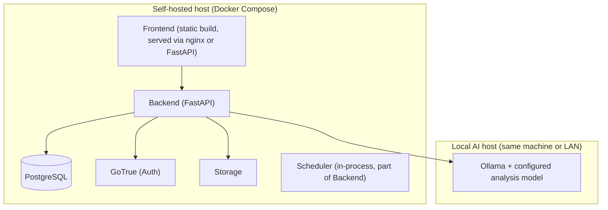

# Technology Stack, Deployment, and Development Workflow

## Target hardware

Production runs on Wassim's real machine: **Ryzen 9 9950X, RTX 5070 Ti (16GB VRAM), 32GB system RAM**, shared with other active software (Docker, browser, coding tools, OS). This is not a dedicated server, and the stack is chosen accordingly — see `14-model-evaluation.md` for the exact analysis model selected against this hardware's VRAM budget, and ADR-010 for why LLM concurrency and pre-filtering are hard constraints rather than tunable defaults. The application's own footprint (backend, Postgres, scheduler, Ollama's non-VRAM overhead) targets **12–16GB RAM, ~20GB hard ceiling**, leaving room for the rest of what's running on the box. The project must never be designed around assuming the full 32GB or the full 16GB VRAM is available to it alone.

## Technology stack (decisive, one primary choice per concern)

| Concern | Choice | Why |
|---|---|---|
| Backend / API | Python 3.12 + FastAPI | Pydantic gives first-class request/response and AI-schema validation, which is central to this system's evidence/verification requirements; async support suits I/O-bound job discovery and AI calls. |
| Data validation / schemas | Pydantic v2 | Same library used for API models, canonical job schema, and AI response schemas — one validation approach throughout, not three. |
| Frontend | React 18 + TypeScript + Vite + Tailwind CSS | React Router for the small fixed set of screens in `05-adhd-ux.md`; Tailwind for fast, consistent styling without a heavy design-system dependency. |
| Database | PostgreSQL | Relational data with clear ownership, needs JSONB for AI-analysis payloads and full-text search for job content — no need for a specialized document/search store at this scale. |
| Auth | Supabase Auth (GoTrue), self-hosted | Mature, well-tested email/password + JWT implementation; avoids hand-rolling auth; self-hosted via Supabase's open-source Docker stack, so it is not a dependency on Supabase's hosted cloud service. |
| Object storage | Supabase Storage, self-hosted | Same open-source stack as above, used only for resumes; private buckets, signed URLs. |
| Job source | Adzuna API | The sole job-discovery source; deterministic, structured, rate-limited — see `03-job-sources.md`, ADR-004. |
| Local AI runtime | Ollama, exactly one pinned analysis model at a time — currently `qwen2.5:14b-instruct-q4_K_M` as the leading candidate, pending real-hardware benchmark validation | Runs one large model, chosen and validated against the real target hardware (see `14-model-evaluation.md`), with no cloud dependency, manually managed by Wassim. Used only for job/CV analysis, never for coding this project. |
| Background jobs / scheduling | APScheduler (in-process); documented upgrade path to a lightweight worker (e.g. Celery + Redis) only if/when scheduled-job volume genuinely requires it | Avoids standing up a message broker for a single user's periodic discovery jobs; the upgrade path exists but is not built prematurely. |
| Containerization | Docker + Docker Compose | Standard, well-understood, matches the "Docker-compatible, self-hosted" requirement without requiring a specific cloud provider. |

### Which Supabase parts are used, and self-hosting compatibility

Only three self-hostable Supabase components are used: **PostgreSQL**, **GoTrue (Auth)**, and **Storage** — all part of Supabase's open-source `docker-compose` distribution, run entirely on the user's own infrastructure. No use of Supabase's hosted cloud platform, Realtime, Edge Functions, or any other Supabase-cloud-specific feature.

## Deployment

- **Development**: everything (Postgres/Auth/Storage via `docker-compose`, Ollama, FastAPI backend with hot reload, Vite dev server) runs on the developer's local machine.
- **Production**: self-hosted on the user's own machine or a small home/private server, via the same Docker Compose stack, no cloud services required. Ollama can run on the same host (with a capable GPU/CPU) or on another machine on the user's local network, addressed via configuration.
- No requirement for Kubernetes, a cloud provider account, a managed database, message queues, or any distributed-systems infrastructure — deliberately, since this is a single-user product and that infrastructure would add operational burden with no benefit.

## Development workflow (building this project) — separate from the product's runtime AI

- **Coding model vs. analysis model.** A coding agent may use a locally-hosted or Ollama-served coding-capable model to help implement this project. This is a completely separate role from the product's own analysis model (`02-ai-and-matching-architecture.md`, "Analysis model vs. coding model") — a coder-tuned model is a reasonable choice for writing code, but the product's job-analysis model is chosen for reasoning, instruction-following, and structured natural-language matching, not coding ability. These two model choices are configured completely independently and are never assumed to be the same model or interchangeable.
- **No Claude anywhere in the product.** Per rule 1 and rule 4, Claude may be used by a human maintainer as a general-purpose assistant outside this project's own runtime (e.g. to write this specification, or as a coding agent during development), but it is never wired into the finished application or its AI analysis pipeline.
- **No coordinator, no multi-agent architecture, no agent swarm — in the product or in the development process.** Development proceeds as: developer or task list gives a scoped, well-defined task; the coding agent implements it; the developer (or a review pass) independently re-runs the tests and inspects the diff rather than trusting a self-reported "tests pass."
- **Task sizing**: implementation proceeds in small, independently-testable increments, each with explicit acceptance criteria, reviewed against the actual code and test run before being considered done. See `15-development-process.md` for the full recursive task-decomposition workflow.
- **If a coding model fails to reliably implement a task or fabricates a result**, the response is the same general principle applied throughout this project: detect it (by independently checking the claimed result) and correct course — never accept a self-report as sufficient evidence.
