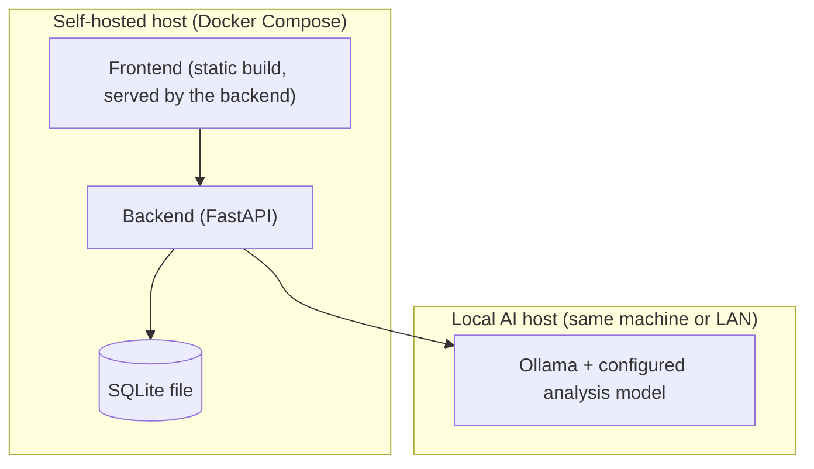

# Technology Stack, Deployment, and Development Workflow

## Target hardware

Production runs on Wassim's real machine: **Ryzen 9 9950X, RTX 5070 Ti (16GB VRAM), 32GB system RAM**, shared with other active software (Docker, browser, coding tools, OS). This is not a dedicated server, and the stack is chosen accordingly — see `14-model-evaluation.md` for the exact analysis model selected against this hardware's VRAM budget, and ADR-010 for why LLM concurrency is fixed at 1 and pre-filtering runs before any model call. The application must not attempt to consume all 32GB of RAM; its own footprint (backend, SQLite, Ollama's non-VRAM overhead) targets **12–16GB RAM, ~20GB hard ceiling**, leaving room for the rest of what's running on the box.

## Technology stack (decisive, one primary choice per concern)

| Concern | Choice | Why |
|---|---|---|
| Backend / API | Python 3.12 + FastAPI | Pydantic gives first-class request/response and AI-schema validation, which is central to this system's evidence-checking requirement; async support suits I/O-bound Adzuna and Ollama calls. |
| Data validation / schemas | Pydantic v2 | Same library used for API models, canonical job schema, and AI response schemas — one validation approach throughout. |
| Frontend | React 18 + TypeScript + Vite + Tailwind CSS | React Router for the four fixed screens in `05-adhd-ux.md`; Tailwind for fast, consistent styling without a heavy design-system dependency. |
| Database | **SQLite**, single file | One local user, modest data volume (one profile, a search's worth of jobs, their analyses) — a database server adds operational surface with no benefit here (`06-database-design.md`, ADR-005). |
| Auth | None for the MVP | Single local user on their own machine; nothing to authenticate against (`01-architecture-overview.md`). |
| File storage | Local filesystem | The one resume file lives on disk, referenced by path from `profile`; no object-storage service. |
| Job source | Adzuna API | The sole job-discovery source; deterministic, structured, rate-limited — see `03-job-sources.md`, ADR-004. |
| Local AI runtime | Ollama, exactly one pinned analysis model — currently `qwen2.5:14b-instruct-q4_K_M` as the leading candidate, pending real-hardware benchmark validation | Runs one large model, chosen and validated against the real target hardware (see `14-model-evaluation.md`), with no cloud dependency, manually managed by Wassim. Used only for job/CV analysis, never for coding this project. |
| Background jobs / scheduling | None for the MVP | Search is a user-triggered HTTP request handled sequentially; no scheduler, no message broker, no worker pool (`02-ai-and-matching-architecture.md`). |
| Containerization | Docker + Docker Compose | Standard, well-understood; the compose file is now small — a backend container (serving the API and the built frontend) plus Ollama, nothing else. |

## Deployment

- **Development**: SQLite file on disk, Ollama, FastAPI backend with hot reload, and the Vite dev server all run on the developer's local machine — no other services to start.
- **Production**: self-hosted on the user's own machine, via the same lightweight Docker Compose stack. Ollama can run on the same host or on another machine on the user's local network, addressed via configuration.
- No requirement for Kubernetes, a cloud provider account, a managed database, a message queue, or any distributed-systems infrastructure.

## Development workflow (building this project) — separate from the product's runtime AI

- **Coding model vs. analysis model.** A coding agent may use a locally-hosted or Ollama-served coding-capable model to help implement this project. This is a completely separate role from the product's own analysis model (`02-ai-and-matching-architecture.md`, "Analysis model vs. coding model") — a coder-tuned model is a reasonable choice for writing code, but the product's job-analysis model is chosen for reasoning, instruction-following, and structured natural-language matching, not coding ability. These two model choices are configured completely independently and are never assumed to be the same model or interchangeable.
- **No Claude anywhere in the product.** Per rule 1 and rule 4, Claude may be used by a human maintainer as a general-purpose assistant outside this project's own runtime (e.g. to write this specification, or as a coding agent during development), but it is never wired into the finished application or its AI analysis pipeline.
- **No coordinator, no multi-agent architecture, no agent swarm — in the product or in the development process.** Development proceeds as: developer or task list gives a scoped, well-defined task; the coding agent implements it; the developer (or a review pass) independently re-runs the tests and inspects the diff rather than trusting a self-reported "tests pass."
- **Task sizing**: implementation proceeds in small, independently-testable increments, each with explicit acceptance criteria, reviewed against the actual code and test run before being considered done. See `15-development-process.md` for the full recursive task-decomposition workflow.
- **If a coding model fails to reliably implement a task or fabricates a result**, the response is the same general principle applied throughout this project: detect it (by independently checking the claimed result) and correct course — never accept a self-report as sufficient evidence.
