# MVP Scope and Roadmap

## MVP — the complete core loop, nothing more

Find job → Extract → Normalize → Deduplicate → Match → Analyze → Verify → Show user → User decides → Track result.

**In scope for MVP:**

- One job source connector (page-based or API-based, whichever the user's actual target sites support most reliably — chosen at implementation time, not prescribed here since it depends on real target sites).
- Full canonical job model, evidence storage, normalization, deduplication.
- User profile and single active resume.
- Deterministic matching engine with configurable weights.
- Local Ollama AI analysis with full schema validation and evidence verification (all six defense layers).
- ADHD-friendly review screens: Home/Today, Job Review, Saved.
- Application tracking through the full state machine, with manual status updates (email monitoring not required for MVP).
- Application preparation (staged materials) with manual apply (browser-automation submission prep can follow once one source is proven reliable).
- Audit logging for all AI calls and status transitions.
- Authentication and RLS-backed data isolation.

**Explicitly out of MVP** (moved to later phases below): multiple job sources, browser-automation application preparation/fill, email monitoring, notifications beyond the Home screen's own queries, model-swapping UI (config-file only for MVP).

MVP succeeds when a user can, end to end, get a newly posted job discovered, see an honest evidence-backed match explanation, approve it, track it through to Applied, and trust every claim shown along the way — without any step requiring a cloud AI call or an unverified AI claim.

## Roadmap

```mermaid
flowchart LR
    P0["Phase 0\nArchitecture"] --> P1["Phase 1\nCore data model"]
    P1 --> P2["Phase 2\nJob discovery"]
    P2 --> P3["Phase 3\nNormalization /\nDeduplication"]
    P3 --> P4["Phase 4\nUser profile / CV"]
    P4 --> P5["Phase 5\nMatching"]
    P5 --> P6["Phase 6\nLocal AI analysis"]
    P6 --> P7["Phase 7\nEvidence /\nVerification"]
    P7 --> P8["Phase 8\nADHD UI"]
    P8 --> P9["Phase 9\nApplication tracking"]
    P9 --> P10["Phase 10\nBrowser automation"]
    P10 --> P11["Phase 11\nEmail monitoring"]
    P11 --> P12["Phase 12\nHardening / testing"]
```

The spec's suggested phase order is kept largely as-is — it is already sound: data model and discovery must exist before matching can run, matching must exist before AI analysis has anything deterministic to sit alongside, and evidence/verification must be built into the AI phase from day one rather than bolted on afterward (this is the one place a strict reading of "Phase 7 comes after Phase 6" could mislead — verification is not an add-on step done later, it is part of the AI Analysis Engine's own contract starting in Phase 6; Phase 7 is where the dedicated Evidence & Verification Layer is hardened and made reusable, not where verification first appears).

- **Phase 0 — Architecture.** This document set.
- **Phase 1 — Core data model.** `users`, `profiles`, `jobs`, `job_evidence`, `companies`, migrations, RLS policies.
- **Phase 2 — Job discovery.** Source adapter interface, first real connector, discovery orchestrator, scheduler.
- **Phase 3 — Normalization / deduplication.** Canonical mapping, dedup identity strategy, unit + fixture tests.
- **Phase 4 — User profile / CV.** Profile CRUD, resume upload + parsing, active-resume selection.
- **Phase 5 — Matching.** Deterministic engine, configurable weights, `job_matches`, factor-breakdown API/UI.
- **Phase 6 — Local AI analysis.** Ollama adapter, model config layer, structured schemas, evidence verification built in from the start, `ai_analyses`.
- **Phase 7 — Evidence / verification hardening.** Dedicated verification module extraction, Verified/Inferred/Unknown labeling end to end, hallucination test suite.
- **Phase 8 — ADHD UI.** Home/Today, Job Review, Saved, Profile screens.
- **Phase 9 — Application tracking.** State machine, `applications`/`application_events`, Application Prep and Applications screens, manual status updates.
- **Phase 10 — Browser automation.** Playwright controller, Stop→Show→Wait→Continue gate, first automated-prep adapter, safeguards from `03-job-sources-and-browser-automation.md`.
- **Phase 11 — Email monitoring.** Mailbox connector, classification pipeline, event linking + confirmation UI.
- **Phase 12 — Hardening / testing.** Full adversarial/edge-case suite from `09-testing-strategy.md`, security review, performance pass, documentation reconciliation against actual implementation.

Each phase should be treated as version-gated in the same spirit as prototype 1's MASTER_PLAN — a phase isn't "done" until its own acceptance criteria (derived from this document set) are met and independently verified, not just implemented.
