# Project Scope and Roadmap

## The complete product, start to finish

User clicks "Search Jobs" → Adzuna → Normalize → Deduplicate → Cheap deterministic filtering → CV/profile matching → One local Ollama model (sequential, one job at a time) → Structured result → Simple evidence verification → Score + explanation → Simple web UI → Original application link → User manually applies.

That loop is the entire product. There is no phase beyond it that adds application tracking, browser automation, an "Assist Me" helper, email monitoring, a scheduler, a queue/worker system, a configurable weighting framework, PostgreSQL, or Mem0 — none of these are planned features. If any of them is ever wanted, it requires a new, explicit decision from Wassim, backed by a demonstrated need; nothing in this document set treats them as deferred or "future."

**In scope:**

- The Adzuna job source connector — the sole job-discovery source (`03-job-sources.md`, ADR-004). No second source, no mock pool.
- User-triggered search ("Search Jobs"); no automatic scheduler.
- Full canonical job model with evidence stored inline on the job row, normalization, deduplication.
- The cheap deterministic pre-filter (a fixed set of checks), so no job reaches the analysis model without first passing hard exclusion/skill/location/salary/employment-type checks.
- User profile (including Adzuna query defaults) and a single resume.
- One local Ollama model, processed sequentially (one job at a time, concurrency fixed at 1), the structured schema from `02-ai-and-matching-architecture.md`, and the five-point evidence-checking pass.
- Four ADHD-friendly screens: Jobs/Search, Job Details, CV/Profile/Preferences, Settings/Status.
- The original Adzuna `redirect_url`, clearly shown, as the end of the system's involvement with a job.
- SQLite as the only database.

**Explicitly not part of this project:**

- Any job source other than Adzuna.
- Browser automation of any kind, Playwright, or any "Assist Me" / application-form-filling capability.
- Any application-submission automation.
- Application tracking, application status, application history, or any post-click outcome recording.
- Email monitoring of any kind.
- A coordinator, multi-agent architecture, or agent swarm, in the product or in development tooling.
- Cloud LLMs, Claude, or any cloud-hosted scoring model.
- A dedicated prompt-injection defense subsystem, framework, or large adversarial test suite.
- A six-layer (or any elaborate multi-layer) hallucination-defense architecture — see `02-ai-and-matching-architecture.md` for the five protections that replace it.
- A configurable, per-factor matching-weight framework — the deterministic pre-filter is a fixed set of checks.
- A queue, worker pool, or background-job system — jobs are analyzed sequentially, one at a time, as part of handling the search request.
- An automatic scheduler or cron job for the MVP — search is a deliberate user action.
- PostgreSQL, self-hosted Supabase, or any database server — SQLite only.
- An authentication/login system for the MVP — single local user.
- A saved-jobs/bookmark table and screen for the MVP.
- An audit-log table — application logging, if needed, is file-based, not a database table.
- Mem0 or any other memory layer — out of scope entirely, not deferred to a later phase.
- Any model-swapping UI, multiple simultaneous models, or automatic model downloads/updates.
- Any multi-user, multi-tenant, or organization concept.
- Microservices, message queues, Kubernetes, or any distributed-systems infrastructure.

The project succeeds when a user can click "Search Jobs," get newly discovered jobs evaluated with an honest evidence-backed explanation, and reach the original application link — without any step requiring a cloud AI call, an unverified AI claim, or infrastructure this single-user local tool doesn't need.

## Roadmap

```mermaid
flowchart LR
    P0["Phase 0\nArchitecture"] --> P1["Phase 1\nCore data model (SQLite)"]
    P1 --> P2["Phase 2\nJob search (user-triggered)"]
    P2 --> P3["Phase 3\nNormalization /\nDeduplication"]
    P3 --> P4["Phase 4\nUser profile / CV"]
    P4 --> P5["Phase 5\nDeterministic pre-filter"]
    P5 --> P6["Phase 6\nOllama analysis (sequential)"]
    P6 --> P7["Phase 7\nEvidence verification"]
    P7 --> P8["Phase 8\nSimple UI (4 screens)"]
    P8 --> P9["Phase 9\nEnd-to-end pipeline /\nHardening / testing"]
```

- **Phase 0 — Architecture.** This document set. Before Phase 1 begins, the pre-implementation planning pass described in `15-development-process.md` runs to completion: this full document set is read, `AGENT_TASKS.md` is created, and the initial task hierarchy is recursively decomposed until every executable task is EASY.
- **Phase 1 — Core data model.** SQLite file, `profile`, `jobs`, `ai_analyses` tables, migrations.
- **Phase 2 — Job search.** Adzuna adapter, the `POST /jobs/search` orchestration, quota handling. No scheduler.
- **Phase 3 — Normalization / deduplication.** Adzuna-field canonical mapping (with evidence stored inline on the job row), dedup identity strategy, unit + fixture tests.
- **Phase 4 — User profile / CV.** Profile read/write (including Adzuna query defaults), single resume storage.
- **Phase 5 — Deterministic pre-filter.** The fixed set of checks (location, salary, employment type, experience level, exclusions, required skills), `passed_prefilter` flag.
- **Phase 6 — Ollama analysis.** Ollama adapter pinned to the exact model in `14-model-evaluation.md`, sequential one-at-a-time processing, compact context construction, the structured schema, schema validation with one retry.
- **Phase 7 — Evidence verification.** The simple containment check against supplied job/CV data, `UNKNOWN`/`NOT_DEMONSTRATED` downgrade path.
- **Phase 8 — Simple UI.** Jobs/Search, Job Details, CV/Profile/Preferences, Settings/Status screens.
- **Phase 9 — End-to-end pipeline, performance, and hardening.** Full adversarial/edge-case suite from `09-testing-strategy.md`, real-hardware performance pass (RAM/VRAM/CPU/GPU under a realistic search), documentation reconciliation against actual implementation.

Each phase should be treated as version-gated — a phase isn't "done" until its own acceptance criteria (derived from this document set) are met and independently verified, not just implemented. Within each phase, work proceeds through `AGENT_TASKS.md`'s recursively-decomposed EASY leaf tasks (`15-development-process.md`), not as one large phase-sized implementation effort.
