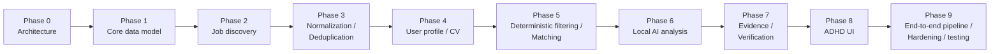

# Project Scope and Roadmap

## The complete product, start to finish

Find job → Extract → Normalize → Deduplicate → Pre-filter → Match → Analyze → Verify → Threshold cutoff → Show user → User reviews → User clicks original application link → User applies manually, outside the app.

That loop is the entire product. There is no phase beyond it that adds application tracking, browser automation, an "Assist Me" helper, or email monitoring — those are not planned features. If any of them is ever wanted, it requires a new, explicit decision from Wassim; nothing in this document set treats them as deferred or "future."

**In scope:**

- The Adzuna job source connector — the sole job-discovery source (`03-job-sources.md`, ADR-004). No second source, no mock pool.
- Full canonical job model, evidence storage (Adzuna's structured fields + snippet + redirect_url), normalization, deduplication.
- The cheap deterministic pre-filter, so no job reaches the analysis model without first passing hard exclusion/skill/location/salary/employment-type checks.
- User profile (including Adzuna query defaults: keywords, location, salary floor, category) and single active resume.
- Deterministic matching engine with configurable weights.
- Local Ollama AI analysis against the current candidate large analysis model (`14-model-evaluation.md`, pending real-hardware benchmark validation), full schema validation and FACT/INFERENCE/UNKNOWN evidence verification (all six defense layers), including named `matching_skills`/`matching_experience`/`missing_requirements`/`unknown_requirements` fields and a configurable relevance-threshold cutoff, low/queued concurrency (default 1).
- ADHD-friendly review screens: Home/Today, Job Review, Saved, Job Search, Profile/CV, Settings.
- The original Adzuna `redirect_url`, clearly shown, as the end of the system's involvement with a job.
- Audit logging for all AI calls and Adzuna calls.
- Authentication and RLS-backed data isolation.

**Explicitly not part of this project:**

- Any job source other than Adzuna, including any general-purpose scraper or a second API-based connector.
- Full-page extraction of the original posting via browser automation (Adzuna's structured fields + snippet are sufficient).
- Browser automation of any kind, Playwright, or any "Assist Me" / application-form-filling capability.
- Any application-submission automation — the system never applies, clicks Apply/Submit, uploads a document, or answers an application question, in any form, under any name.
- Application tracking, application status, application history, or any post-click outcome recording. This is intentionally outside the project's boundary — the user tracks their own applications elsewhere.
- Email monitoring of any kind.
- A coordinator, multi-agent architecture, or agent swarm, in the product or in development tooling.
- Cloud LLMs, Claude, or any cloud-hosted scoring model.
- A dedicated prompt-injection defense subsystem, framework, or large adversarial test suite — job text is treated as untrusted data with a small, practical sanity check (`09-testing-strategy.md`), nothing more.
- Any model-swapping UI — the candidate analysis model is a config-file value plus this document's own record, not a user-facing setting.
- LLM concurrency above the low default.
- Any multi-user, multi-tenant, or organization concept.
- Microservices, message queues, Kubernetes, or any distributed-systems infrastructure.

The project succeeds when a user can, end to end, get a newly posted job discovered, see an honest evidence-backed match explanation, and reach the original application link — without any step requiring a cloud AI call or an unverified AI claim.

## Roadmap

- **Phase 0 — Architecture.** This document set. Before Phase 1 begins, the pre-implementation planning pass described in `15-development-process.md` runs to completion: relevant prior source code and this full document set are read, `AGENT_TASKS.md` is created, and the initial task hierarchy is recursively decomposed until every executable task is EASY.
- **Phase 1 — Core data model.** `users`, `profiles`, `jobs`, `job_evidence`, `companies`, migrations, RLS policies.
- **Phase 2 — Job discovery.** Source adapter interface plus the one real implementation (Adzuna connector), discovery orchestrator, scheduler, quota handling.
- **Phase 3 — Normalization / deduplication.** Adzuna-field canonical mapping, dedup identity strategy (Adzuna id → redirect_url → composite key), unit + fixture tests.
- **Phase 4 — User profile / CV.** Profile CRUD (including Adzuna query defaults), resume upload + parsing, active-resume selection.
- **Phase 5 — Deterministic filtering / matching.** The cheap pre-filter, deterministic scoring engine, configurable weights, `job_matches`, factor-breakdown API/UI.
- **Phase 6 — Local AI analysis.** Ollama adapter pinned to the exact model in `14-model-evaluation.md`, low/queued concurrency, the structured schema from `02-ai-and-matching-architecture.md`, evidence verification (Adzuna-wins rule) built in from the start, `ai_analyses`.
- **Phase 7 — Evidence / verification hardening.** Dedicated verification module extraction, FACT/INFERENCE/UNKNOWN labeling end to end, hallucination test suite.
- **Phase 8 — ADHD UI.** Home/Today, Job Review, Saved, Job Search, Profile screens.
- **Phase 9 — End-to-end pipeline, performance, and hardening.** Full adversarial/edge-case suite from `09-testing-strategy.md`, real-hardware performance pass (RAM/VRAM/CPU/GPU under realistic concurrent load), documentation reconciliation against actual implementation.

Each phase should be treated as version-gated — a phase isn't "done" until its own acceptance criteria (derived from this document set) are met and independently verified, not just implemented. Within each phase, work proceeds through `AGENT_TASKS.md`'s recursively-decomposed EASY leaf tasks (`15-development-process.md`), not as one large phase-sized implementation effort.
