# MVP Scope and Roadmap

## MVP — the complete core loop, nothing more

Find job (Adzuna) → Normalize → Deduplicate → Pre-filter → Match → Analyze → Verify → Show user → User decides → Track result.

**In scope for MVP:**

- The Adzuna job source connector — the sole, mandatory MVP source (`03-job-sources-and-browser-automation.md`, ADR-004). No second source, no mock pool.
- Full canonical job model, evidence storage (Adzuna's structured fields + snippet + redirect_url), normalization, deduplication.
- The cheap deterministic pre-filter, so no job reaches the LLM without first passing hard exclusion/skill/location/salary checks.
- User profile (including Adzuna query defaults: keywords, location, salary floor, category) and single active resume.
- Deterministic matching engine with configurable weights.
- Local Ollama AI analysis against the one pinned model (`14-model-evaluation.md`), full schema validation and FACT/INFERENCE/UNKNOWN evidence verification (all six defense layers), low/queued concurrency (default 1).
- ADHD-friendly review screens: Home/Today, Job Review, Saved.
- Application tracking through the full 11-state lifecycle (`04-application-lifecycle-and-email.md`), with manual status updates (email monitoring not required for MVP).
- Application preparation (staged materials) through `READY_FOR_USER`, with manual apply — browser-automation form-fill can follow once staged-materials preparation is proven reliable.
- Audit logging for all AI calls, Adzuna calls, and status transitions.
- Authentication and RLS-backed data isolation.

**Explicitly out of MVP:**

- Any job source other than Adzuna, including any general-purpose scraper or a second API-based connector.
- Full-page extraction of the original posting via browser automation (Adzuna's structured fields + snippet are sufficient for MVP matching/evidence).
- Browser-automation application form-fill (`PREPARING`/`READY_FOR_USER` in MVP use staged materials only, applied manually).
- Email monitoring and its associated confirmation UI.
- Notifications beyond the Home screen's own live queries (no push/email/SMS notification channel).
- Any model-swapping UI — the pinned model is a config-file value plus this document's own record, not a user-facing setting in MVP.
- LLM concurrency above the low default — no "speed up analysis" control in MVP.
- Any multi-user, multi-tenant, or organization concept.
- A `job_sources` configuration table/UI (there is nothing to configure among sources in MVP; see `06-database-design.md`).
- Any bulk/automatic apply-to-many-jobs action, at any confirmation level.

MVP succeeds when a user can, end to end, get a newly posted job discovered via Adzuna, see an honest evidence-backed match explanation, approve it, track it through to Applied, and trust every claim shown along the way — without any step requiring a cloud AI call, an unverified AI claim, or the LLM ever deciding what jobs exist.

## Roadmap

```mermaid
flowchart LR
    P0["Phase 0\nArchitecture"] --> P1["Phase 1\nCore data model"]
    P1 --> P2["Phase 2\nJob discovery"]
    P2 --> P3["Phase 3\nNormalization /\nDeduplication"]
    P3 --> P4["Phase 4\nUser profile / CV"]
    P4 --> P5["Phase 5\nMatching"]
    P5 --> P6["Phase 6\nLocal AI analysis"]
    P6 --> P7["Phase 7\nEvidence /\nVerification"]
    P7 --> P8["Phase 8\nADHD UI"]
    P8 --> P9["Phase 9\nApplication tracking"]
    P9 --> P10["Phase 10\nBrowser automation"]
    P10 --> P11["Phase 11\nEmail monitoring"]
    P11 --> P12["Phase 12\nHardening / testing"]
```

The spec's suggested phase order is kept largely as-is — it is already sound: data model and discovery must exist before matching can run, matching must exist before AI analysis has anything deterministic to sit alongside, and evidence/verification must be built into the AI phase from day one rather than bolted on afterward (this is the one place a strict reading of "Phase 7 comes after Phase 6" could mislead — verification is not an add-on step done later, it is part of the AI Analysis Engine's own contract starting in Phase 6; Phase 7 is where the dedicated Evidence & Verification Layer is hardened and made reusable, not where verification first appears).

- **Phase 0 — Architecture.** This document set.
- **Phase 1 — Core data model.** `users`, `profiles`, `jobs`, `job_evidence`, `companies`, migrations, RLS policies.
- **Phase 2 — Job discovery.** Source adapter interface plus the one real implementation (Adzuna connector), discovery orchestrator, scheduler, quota handling.
- **Phase 3 — Normalization / deduplication.** Adzuna-field canonical mapping, dedup identity strategy (Adzuna id → redirect_url → composite key), unit + fixture tests.
- **Phase 4 — User profile / CV.** Profile CRUD (including Adzuna query defaults), resume upload + parsing, active-resume selection.
- **Phase 5 — Matching.** Deterministic engine, configurable weights, the cheap pre-filter, `job_matches`, factor-breakdown API/UI.
- **Phase 6 — Local AI analysis.** Ollama adapter pinned to the exact model in `14-model-evaluation.md`, low/queued concurrency, structured FACT/INFERENCE/UNKNOWN schemas, evidence verification (Adzuna-wins rule) built in from the start, `ai_analyses`.
- **Phase 7 — Evidence / verification hardening.** Dedicated verification module extraction, FACT/INFERENCE/UNKNOWN labeling end to end, hallucination test suite.
- **Phase 8 — ADHD UI.** Home/Today, Job Review, Saved, Profile screens.
- **Phase 9 — Application tracking.** State machine, `applications`/`application_events`, Application Prep and Applications screens, manual status updates.
- **Phase 10 — Browser automation.** Playwright controller, Stop→Show→Wait→Continue gate, first automated-prep adapter, safeguards from `03-job-sources-and-browser-automation.md`.
- **Phase 11 — Email monitoring.** Mailbox connector, classification pipeline, event linking + confirmation UI.
- **Phase 12 — Hardening / testing.** Full adversarial/edge-case suite from `09-testing-strategy.md`, security review, real-hardware VRAM/RAM measurement against `14-model-evaluation.md`'s budget, documentation reconciliation against actual implementation.

Each phase should be treated as version-gated in the same spirit as prototype 1's MASTER_PLAN — a phase isn't "done" until its own acceptance criteria (derived from this document set) are met and independently verified, not just implemented.
